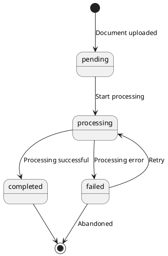

## Entity and State Documentation Guidelines

This guide explains how to document entities, their attributes, states, state transitions, and validation rules in specification documents.

## Entity Definition Structure

Each entity should be documented with the following sections:

### Attributes

List all attributes of the entity with their types and descriptions.

**Format**: `attribute_name`: Type - Description

**Example**:
```markdown
- **Attributes**: 
  - `file_path`: String - Path to the document file
  - `file_type`: String - Detected file type (PDF, DOCX, etc.)
  - `file_size`: Integer - File size in bytes
  - `metadata`: JSON - Extracted document metadata (title, author, etc.)
  - `cached_markdown_path`: String - Path to cached markdown file
  - `processing_status`: String - Status of processing (pending, completed, failed)
  - `created_at`: DateTime - When document was first processed
  - `updated_at`: DateTime - Last processing attempt
```

**Guidelines**:
- Use clear, descriptive attribute names
- Specify data types (String, Integer, Boolean, DateTime, JSON, Enum, etc.)
- Provide brief but meaningful descriptions
- Include timestamps for audit trails when applicable
- Document optional vs required attributes if relevant

### States

List all possible states the entity can be in. States represent distinct conditions or phases in the entity's lifecycle.

**Format**: `state_name` - Description

**Example**:
```markdown
- **States**: 
  - `pending` - Document uploaded, awaiting processing
  - `processing` - Currently being processed
  - `completed` - Successfully processed with cached markdown
  - `failed` - Processing failed with error
```

**Guidelines**:
- Use lowercase, descriptive state names
- Keep state names concise but clear
- Document all possible states, including error states
- Ensure states are mutually exclusive
- Consider terminal states (states that don't transition to others)

### State Transitions

Document how the entity moves between states. Show the valid transition paths.

**Format**: `state_a` → `state_b` → `state_c` (description)

**Example**:
```markdown
- **State Transitions**:
  - `pending` → `processing` → `completed` (success path)
  - `pending` → `processing` → `failed` (error path)
  - `failed` → `processing` → `completed` (retry path)
```

**Guidelines**:
- Show complete paths from start to end states
- Include both success and error paths
- Document retry/recovery paths when applicable
- Label paths with descriptive names (success path, error path, retry path)
- Consider using state diagrams for complex transition logic
- Document conditions that trigger each transition if relevant

### Validation Rules

List all validation rules that apply to the entity. These rules define constraints and business logic that must be enforced.

**Format**: Rule description

**Example**:
```markdown
- **Validation Rules**:
  - File type must be supported (PDF, DOCX, TXT)
  - File size must be within limits (max 50MB)
  - File must not be corrupted or empty
  - Markdown files (.md) are rejected as input
  - File path must be valid and accessible
```

**Guidelines**:
- Be specific about constraints (e.g., "max 50MB" not just "size limits")
- Include both positive and negative validation rules
- Document format requirements, range constraints, and business rules
- Specify error handling for validation failures
- Group related validation rules together

## Complete Entity Documentation Example

```markdown
### Document Entity

- **Attributes**: 
  - `file_path`: String - Path to the document file
  - `file_type`: String - Detected file type (PDF, DOCX, etc.)
  - `file_size`: Integer - File size in bytes
  - `metadata`: JSON - Extracted document metadata (title, author, etc.)
  - `cached_markdown_path`: String - Path to cached markdown file
  - `processing_status`: String - Status of processing (pending, completed, failed)
  - `created_at`: DateTime - When document was first processed
  - `updated_at`: DateTime - Last processing attempt

- **States**: 
  - `pending` - Document uploaded, awaiting processing
  - `processing` - Currently being processed
  - `completed` - Successfully processed with cached markdown
  - `failed` - Processing failed with error

- **State Transitions**:
  - `pending` → `processing` → `completed` (success path)
  - `pending` → `processing` → `failed` (error path)
  - `failed` → `processing` → `completed` (retry path)

- **Validation Rules**:
  - File type must be supported (PDF, DOCX, TXT)
  - File size must be within limits (max 50MB)
  - File must not be corrupted or empty
  - Markdown files (.md) are rejected as input
  - File path must be valid and accessible
```

## State Diagram (Optional)

For complex state machines, consider using a PlantUML state diagram:



## Documentation Checklist

Use this checklist to verify entity and state documentation is complete:

- [ ] All attributes are documented with type and description
- [ ] All possible states are listed
- [ ] States are mutually exclusive and clearly defined
- [ ] All valid state transitions are documented
- [ ] Both success and error paths are covered
- [ ] Retry/recovery paths are documented (if applicable)
- [ ] All validation rules are specified
- [ ] Validation rules include specific constraints and thresholds
- [ ] State transitions are labeled with descriptive names
- [ ] Complex state machines include diagrams when helpful

