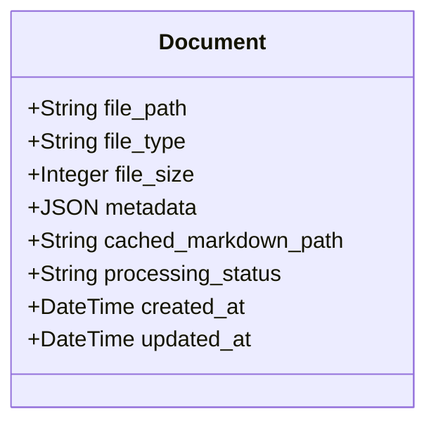
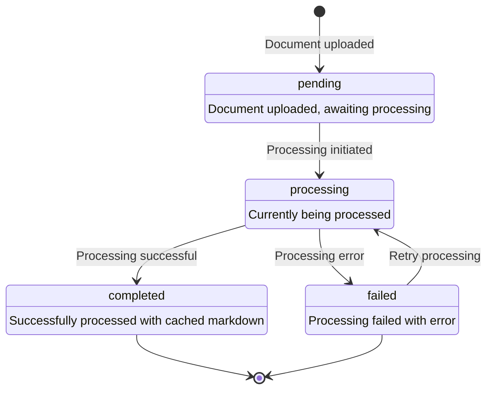
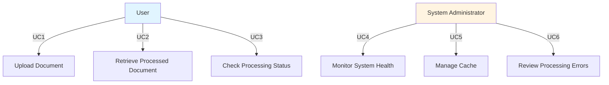
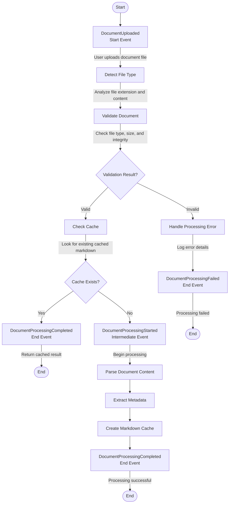

# Document Parsing
## Specification
### Entity Definition
#### Document Entity

**Entity Structure:**



**State Diagram:**



**Validation Rules**:
- File type must be supported (PDF, DOCX, TXT)
- File size must be within limits (max 50MB)
- File must not be corrupted or empty
- Markdown files (.md) are rejected as input
- File path must be valid and accessible

### Use Cases

#### Requirements for Use Cases

- **Only human end users**: Use cases must only include human end users as actors. System components, automated services, background jobs, or internal system processes should NOT be defined as actors or use cases.
- **User-focused**: Use cases describe what human users want to accomplish with the system, not how the system internally processes data.
- **System behavior in workflows**: System-level behavior (validation, processing, background tasks) should be documented in Business Process Documentation (Activity Flow Diagrams, Event Sequence Diagrams) rather than as use cases.
- **Actor definition**: Each actor must be a human role (e.g., User, Administrator, Manager, Customer) with clear business objectives.

#### Actors

**User**
- **Description**: An end user who needs to process documents for analysis or content extraction. Users interact with the system through the API to upload documents and retrieve processed results.
- **Objectives**: 
  - Upload documents in supported formats (PDF, DOCX, TXT)
  - Receive processed document content in markdown format
  - Understand validation errors when documents are rejected
  - Access cached results for previously processed documents

**System Administrator**
- **Description**: A technical administrator responsible for system maintenance, monitoring processing workflows, and managing system configuration.
- **Objectives**:
  - Monitor document processing status and system health
  - Manage cache and storage resources
  - Review processing errors and system logs
  - Configure system limits and validation rules

#### Use Case Diagram



**Note**: System-level operations (document validation, processing, metadata extraction, cache management) are not included as use cases. These are documented in the Business Process Documentation section (Activity Flow Diagrams, Event Sequence Diagrams) as internal system workflows.

#### Use Case Descriptions

**UC1: Upload Document**
- **Actor**: User
- **Objective**: Upload a document file to the system for processing
- **Description**: The user provides a document file (PDF, DOCX, or TXT) to the system via the API. The system validates the file type, size, and integrity, then initiates the processing workflow. If validation fails, the user receives clear error messages explaining the rejection reason.
- **Preconditions**: User has a valid document file and API access credentials
- **Postconditions**: Document entity is created in "pending" state, or validation error is returned to user
- **Main Flow**: 
  1. User uploads document file
  2. System detects file type
  3. System validates file (type, size, integrity)
  4. If valid, document entity created in "pending" state
  5. DocumentUploaded event is raised
  6. User receives confirmation with document ID

**UC2: Retrieve Processed Document**
- **Actor**: User
- **Objective**: Retrieve the processed markdown content and metadata for a document
- **Description**: After a document has been processed, the user can retrieve the cached markdown content and extracted metadata. If the document is still processing, the user receives the current processing status.
- **Preconditions**: Document has been uploaded and processing has been initiated
- **Postconditions**: User receives processed content or current status
- **Main Flow**:
  1. User requests processed document by document ID
  2. System checks document status
  3. If completed, system returns cached markdown and metadata
  4. If processing, system returns current status
  5. If failed, system returns error information

**UC3: Check Processing Status**
- **Actor**: User
- **Objective**: Check the current processing status of an uploaded document
- **Description**: The user can query the system to determine whether a document is pending, processing, completed, or failed. This allows users to track progress without polling for results.
- **Preconditions**: Document has been uploaded
- **Postconditions**: User receives current document status
- **Main Flow**:
  1. User requests status for document ID
  2. System retrieves document entity
  3. System returns current processing status
  4. If completed, system includes completion timestamp
  5. If failed, system includes error details

**UC4: Monitor System Health**
- **Actor**: System Administrator
- **Objective**: Monitor overall system health, processing throughput, and resource utilization
- **Description**: Administrators can access system metrics including processing queue length, success/failure rates, cache hit rates, and system resource usage to ensure optimal performance.
- **Preconditions**: Administrator has monitoring access
- **Postconditions**: Administrator has visibility into system health metrics
- **Main Flow**:
  1. Administrator accesses monitoring dashboard
  2. System aggregates processing metrics
  3. System displays queue status, throughput, error rates
  4. Administrator reviews metrics and identifies issues

**UC5: Manage Cache**
- **Actor**: System Administrator
- **Objective**: Manage cached markdown files to optimize storage and performance
- **Description**: Administrators can view cache statistics, clear specific cached documents, or purge cache based on age or size criteria. This helps manage storage resources and ensures cache freshness.
- **Preconditions**: Administrator has cache management access
- **Postconditions**: Cache is updated according to administrator actions
- **Main Flow**:
  1. Administrator accesses cache management interface
  2. System displays cache statistics (size, hit rate, oldest entries)
  3. Administrator selects cache management action (view, clear specific, purge by criteria)
  4. System executes action and updates cache
  5. System confirms action completion

**UC6: Review Processing Errors**
- **Actor**: System Administrator
- **Objective**: Review and analyze document processing failures to identify patterns and system issues
- **Description**: Administrators can access error logs, view failed document details, and analyze error patterns (e.g., common file types that fail, corruption patterns, timeout issues) to improve system reliability.
- **Preconditions**: Document processing failures have occurred
- **Postconditions**: Administrator has insight into processing errors
- **Main Flow**:
  1. Administrator accesses error log interface
  2. System retrieves failed document records
  3. System displays error details (error type, message, timestamp, document metadata)
  4. Administrator analyzes error patterns
  5. Administrator takes corrective action if needed

### Acceptance Criteria

#### Requirements for Acceptance Criteria Management

- **Never re-number acceptance criteria once created**: Once an acceptance criteria (AC) has been assigned an ID (e.g., AC 1, AC 2), that ID must remain permanent. Do not renumber existing acceptance criteria even if others are added, removed, or reordered.

- **Never delete acceptance criteria once created**: If an acceptance criteria is no longer needed or becomes obsolete, mark it as deprecated rather than deleting it. Use the following format:
  - `- [ ] ~~AC X - Scenario: [description]~~ (DEPRECATED)`
  - Or add a deprecation note explaining why it's deprecated and when it was deprecated

#### Examples

##### Example 1: Basic Scenario (Happy Path)

```gherkin
- Feature: Document Upload and Processing
  As a user
  I want to upload and process document files
  So that I can analyze their content

  - [ ] AC 1 - Scenario: Successfully upload and process a valid document
    Given a user has a valid PDF document file
    And the file size is 5MB
    When the user uploads the document to the system
    Then the Document entity should detect the file type through domain logic
    And the Document entity should transition to "pending" state through a validated state transition method
    And the Document entity should raise a "DocumentUploaded" domain event with file metadata

  - [ ] AC 2 - Scenario: Process uploaded document to completion
    Given a document entity exists in "pending" state
    And the document has a valid file path
    When document processing is initiated
    Then the Document entity should transition from "pending" to "processing" through a validated state transition method
    And the Document entity should transition from "processing" to "completed" upon successful parsing
    And the Document entity should raise a "DocumentProcessed" domain event with processing metadata
```

##### Example 2: Negative Scenario (Error Handling)

```gherkin
- Feature: Document Validation and Rejection
  As a user
  I want the system to reject invalid files
  So that I understand the system's input requirements

  - [ ] AC 3 - Scenario: Reject markdown files as input
    Given a user has a markdown file with extension ".md"
    And the file contains valid markdown content
    When the user attempts to upload the markdown file as input
    Then the Document entity should reject the file through domain validation logic
    And the Document entity should raise a "DocumentRejected" domain event with rejection reason
    But the Document entity should not create a document instance
    But the Document entity should not transition to any processing state
```

##### Example 3: Scenario Outline (Parameterized Scenarios)

```gherkin
- Feature: File Type Validation
  As a user
  I want to upload documents of different types
  So that I can process various document formats

  - [ ] AC 4 - Scenario Outline: Validate supported and unsupported file types
    Given a user has a document file with extension "<file_extension>"
    And the file size is "<file_size>" MB
    When the user uploads the document to the system
    Then the Document entity should "<validation_result>"
    And the Document entity should raise a "<domain_event>" domain event

    Examples:
      | file_extension | file_size | validation_result                                    | domain_event        |
      | .pdf           | 10        | accept the file type through domain validation logic | DocumentUploaded    |
      | .docx          | 5         | accept the file type through domain validation logic | DocumentUploaded    |
      | .txt           | 2         | accept the file type through domain validation logic | DocumentUploaded    |
      | .md            | 1         | reject the file through domain validation logic      | DocumentRejected    |
      | .exe           | 3         | reject the file through domain validation logic      | DocumentRejected    |
      | .zip           | 8         | reject the file through domain validation logic      | DocumentRejected    |
```

### Business Process Documentation

#### Business Events

- **Event: DocumentUploaded**
  - **Event Type**: Start Event
  - **Trigger**: User uploads a document file to the system
  - **Payload**: 
    - `file_path`: String - Path to uploaded document
    - `file_type`: String - Detected file type (PDF, DOCX, TXT)
    - `file_size`: Integer - File size in bytes
    - `upload_timestamp`: DateTime - When upload occurred
  - **Consumers**: Document validation process, file type detection handler
  - **Business Context**: Represents the initiation of document processing workflow

- **Event: DocumentValidationCompleted**
  - **Event Type**: Intermediate Event
  - **Trigger**: Document validation checks (file type, size, corruption) are completed
  - **Payload**:
    - `document_id`: String - Unique document identifier
    - `validation_result`: Enum - Valid, Invalid, Rejected
    - `validation_errors`: Array[String] - List of validation errors if invalid
    - `validated_at`: DateTime - When validation completed
  - **Consumers**: Document processing orchestrator, error handling service
  - **Business Context**: Determines whether document can proceed to processing stage

- **Event: DocumentProcessingCompleted**
  - **Event Type**: End Event
  - **Trigger**: Document has been successfully processed and cached markdown created
  - **Payload**:
    - `document_id`: String - Unique document identifier
    - `cached_markdown_path`: String - Path to cached markdown file
    - `metadata`: JSON - Extracted document metadata
    - `processed_at`: DateTime - When processing completed
  - **Consumers**: Notification service, cache management service
  - **Business Context**: Indicates successful completion of document processing workflow

- **Event: DocumentProcessingFailed**
  - **Event Type**: End Event
  - **Trigger**: Document processing encountered an error and failed
  - **Payload**:
    - `document_id`: String - Unique document identifier
    - `error_message`: String - Description of the error
    - `error_type`: String - Type of error (corruption, timeout, parsing error)
    - `failed_at`: DateTime - When processing failed
  - **Consumers**: Error handling service, retry mechanism
  - **Business Context**: Indicates failure in document processing workflow, may trigger retry logic

#### Activity Flow Diagram



#### Event Sequence Diagram

```mermaid
sequenceDiagram
    actor User
    participant Upload as Upload Service
    participant Events as Event Bus
    participant Validation as Validation Service
    participant Cache as Cache Service
    participant Processing as Processing Service

    User->>Upload: Upload document
    activate Upload
    Upload->>Events: **DocumentUploaded** (Start Event)
    deactivate Upload

    Events->>Validation: DocumentUploaded event
    activate Validation
    Validation->>Validation: Detect file type
    Validation->>Validation: Validate file
    Validation->>Events: **DocumentValidationCompleted** (Intermediate)
    deactivate Validation

    alt Validation Result = Valid
        Events->>Cache: DocumentValidationCompleted event
        activate Cache
        Cache->>Cache: Check for cached markdown
        
        alt Cache Exists
            Cache->>Events: **DocumentProcessingCompleted** (End Event - from cache)
            deactivate Cache
        else Cache Missing
            Cache->>Events: Cache miss
            deactivate Cache
            
            Events->>Processing: Process document
            activate Processing
            Processing->>Events: **DocumentProcessingStarted** (Intermediate)
            Processing->>Processing: Parse content
            Processing->>Processing: Extract metadata
            Processing->>Processing: Create cache
            Processing->>Events: **DocumentProcessingCompleted** (End Event)
            deactivate Processing
        end
    else Validation Result = Invalid
        Events->>Processing: DocumentValidationCompleted event (invalid)
        activate Processing
        Processing->>Events: **DocumentProcessingFailed** (End Event)
        deactivate Processing
    end
```

### Contracts and APIs

#### REST API Contract

**OpenAPI Specification:**

```yaml
openapi: 3.1.0
info:
  title: Document Processing API
  version: 1.0.0

paths:
  /api/v1/documents:
    post:
      summary: Upload and process a document
      requestBody:
        required: true
        content:
          application/json:
            schema:
              $ref: '#/components/schemas/DocumentUploadRequest'
      responses:
        '201':
          description: Document uploaded successfully
          content:
            application/json:
              schema:
                $ref: '#/components/schemas/DocumentResponse'
        '400':
          description: Validation error
          content:
            application/json:
              schema:
                $ref: '#/components/schemas/ErrorResponse'
      security:
        - bearerAuth: []

components:
  securitySchemes:
    bearerAuth:
      type: http
      scheme: bearer

  schemas:
    DocumentUploadRequest:
      type: object
      required:
        - file_path
      properties:
        file_path:
          type: string
        file_type:
          type: string
          enum: [PDF, DOCX, TXT]

    DocumentResponse:
      type: object
      required:
        - document_id
        - status
        - file_path
      properties:
        document_id:
          type: string
          format: uuid
        status:
          type: string
          enum: [pending, processing, completed, failed]
        file_path:
          type: string

    ErrorResponse:
      type: object
      required:
        - error
      properties:
        error:
          type: object
          required:
            - code
            - message
          properties:
            code:
              type: string
            message:
              type: string
```
### E2E Test Cases

- [ ] **File Type Detection**: Upload PDF/DOCX → Accepted; Upload .exe/.md → Rejected
- [ ] **First-Time Processing**: Upload new document → Creates cached .md file with content
- [ ] **Markdown Rejection**: Upload .md file → Rejected with clear error message
- [ ] **Cache Utilization**: Upload same document twice → Second upload uses cache (faster)
- [ ] **Metadata Extraction**: Process document → Extracts and stores metadata (title, author, etc.)
- [ ] **Error Handling**: Upload corrupted/empty file → Handles gracefully with error message
- [ ] **Size/Timeout Limits**: Upload oversized file → Rejected with limit error message
- [ ] **Base Parser**: System initialization → Base parser class available with common functionality