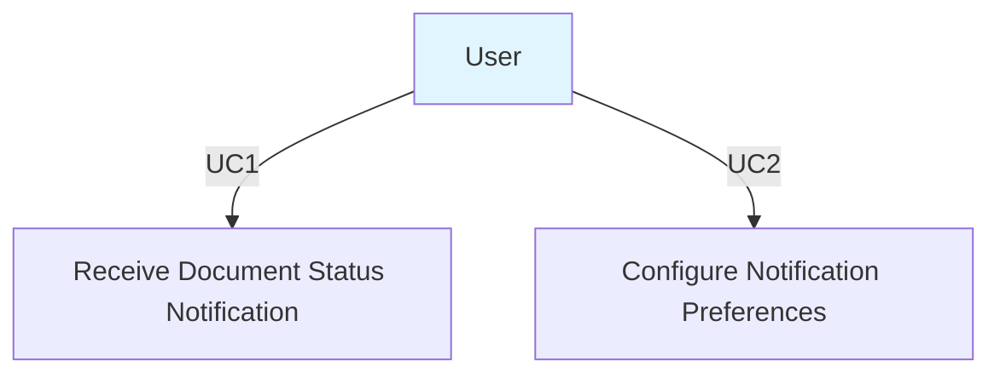
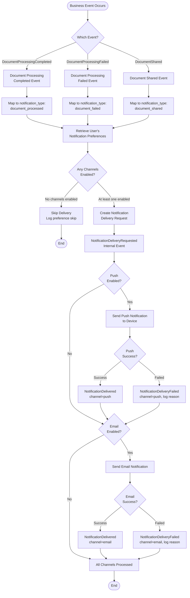
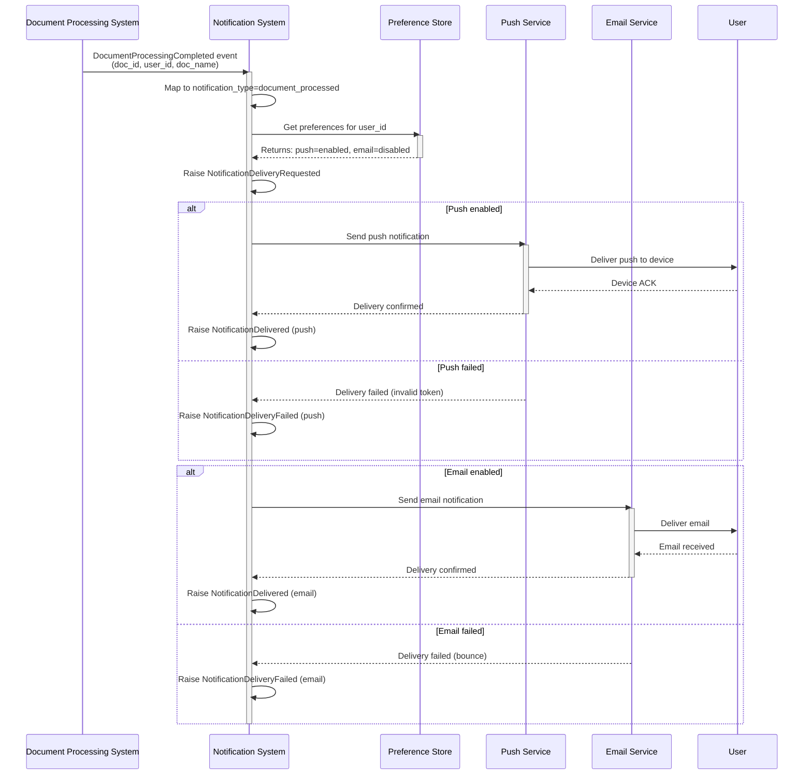

# User Notifications System

## Product Specification

### Business Context

**Problem Statement:**
Users are missing important updates about document processing because they don't check the app regularly. Document processing completes quickly, but users don't know about it for hours or days,
leading to complaints about slow response times even though processing is fast.

**Business Value:**

- Reduce time-to-action from hours to minutes
- Improve user satisfaction scores
- Reduce support burden from "where's my document?" inquiries

**Success Metrics:**

- 80%+ of users enable notifications
- Average time-to-action under 5 minutes (from notification delivery to user action)

---

### Scope

**In Scope:**

- Push notifications for mobile users (iOS/Android) - MUST HAVE
- Email notifications as fallback channel - NICE TO HAVE
- Three notification types:
    1. Document processing completed (most critical)
    2. Document processing failed with errors
    3. New document shared with user
- Per-type notification preferences (users can disable specific types)
- Per-channel preferences (users can enable/disable push and email independently per type)

**Out of Scope:**

- SMS notifications
- In-app notification banners
- Browser notifications
- Notification history/inbox UI
- Read/unread status tracking
- Notification archiving
- Quiet hours or delivery scheduling
- Priority levels

---

### Use Cases

#### Requirements for Use Cases

- **Only human end users**: Use cases must only include human end users as actors. System components, automated services, background jobs, or internal system processes should NOT be defined as actors
  or use cases.
- **User-focused**: Use cases describe what human users want to accomplish with the system, not how the system internally processes data.
- **System behavior in workflows**: System-level behavior (validation, delivery, retry logic, queueing) should be documented in Business Process Documentation (Activity Flow Diagrams, Event Sequence
  Diagrams) rather than as use cases.
- **Actor definition**: Each actor must be a human role (e.g., User, Administrator, Manager, Customer) with clear business objectives.

#### Actors

**User**

- **Description**: A person using the mobile app who uploads and processes documents. Users need timely awareness when their documents finish processing so they can take action quickly.
- **Objectives**:
    - Know immediately when document processing completes (most important)
    - Know when document processing fails so they can correct issues
    - Know when someone shares a document with them
    - Control which notification types they receive
    - Choose whether to receive notifications via push, email, or both

#### Use Case Diagram



**Note**: System-level operations (notification triggering, queueing, delivery, retry logic) are not included as use cases. These are documented in the Business Process Documentation section as
internal system workflows.

#### Use Case Descriptions

**UC1: Receive Document Status Notification**

- **Actor**: User
- **Objective**: Be notified immediately when a document processing event occurs
- **Description**: When a user's document finishes processing (successfully or with errors) or when another user shares a document with them, they receive a notification through their enabled channel(
  s). The notification contains a brief message and a link to open the relevant document in the app.
- **Preconditions**:
    - User has uploaded a document for processing, OR another user shared a document with them
    - User has at least one notification channel enabled for this notification type
    - User's device is registered for push notifications (if push enabled)
    - User has valid email address on file (if email enabled)
- **Postconditions**:
    - User receives notification via enabled channel(s) within seconds of the event
    - User can tap/click notification to open the relevant document in the app
- **Main Flow**:
    1. Document processing completes/fails OR document is shared
    2. User receives notification on their mobile device (if push enabled)
    3. User receives notification via email (if email enabled)
    4. Notification displays: title, brief message, and allows user to open document
    5. User taps notification to open document in app

**UC2: Configure Notification Preferences**

- **Actor**: User
- **Objective**: Control which notification types to receive and through which channels
- **Description**: Users access notification settings to enable or disable specific notification types (document completed, document failed, document shared). For each type, users can independently
  enable/disable push notifications and email notifications.
- **Preconditions**: User has account and access to app settings
- **Postconditions**: User's preferences are saved and applied to future notifications
- **Main Flow**:
    1. User navigates to notification settings
    2. User sees list of three notification types:
        - Document processing completed
        - Document processing failed
        - New document shared with you
    3. For each type, user can toggle:
        - Push notifications (on/off)
        - Email notifications (on/off)
    4. User saves preferences
    5. Future notifications respect these preferences

---

### Acceptance Criteria

#### Requirements for Acceptance Criteria Management

- **Never re-number acceptance criteria once created**: Once an acceptance criteria (AC) has been assigned an ID (e.g., AC 1, AC 2), that ID must remain permanent. Do not renumber existing acceptance
  criteria even if others are added, removed, or reordered.

- **Never delete acceptance criteria once created**: If an acceptance criteria is no longer needed or becomes obsolete, mark it as deprecated rather than deleting it.

#### Acceptance Criteria Scenarios

##### Feature: Document Processing Notifications

```gherkin
- Feature: Document Processing Notifications
  As a user
  I want to receive notifications when my documents finish processing
  So that I can take action within minutes instead of hours

  - [ ] AC 1 - Scenario: User receives push notification when document processing completes
    Given a user has push notifications enabled for "document_processed" type
    And the user has a document in processing state
    And the user's device is registered for push notifications
    When the document processing completes successfully
    Then the user should receive a push notification within 10 seconds
    And the notification title should indicate "Document Ready" or similar
    And the notification message should briefly describe the document
    And tapping the notification should open the document in the app

  - [ ] AC 2 - Scenario: User receives email notification when document processing completes
    Given a user has email notifications enabled for "document_processed" type
    And the user has a valid email address on file
    And the user has a document in processing state
    When the document processing completes successfully
    Then the user should receive an email notification within 1 minute
    And the email subject should indicate document is ready
    And the email body should contain document details
    And the email should include a link to open the document in the app

  - [ ] AC 3 - Scenario: User receives both push and email when both are enabled
    Given a user has both push and email enabled for "document_processed" type
    And the user has a document in processing state
    When the document processing completes successfully
    Then the user should receive a push notification
    And the user should receive an email notification
    And both notifications should contain the same information

  - [ ] AC 4 - Scenario: User receives notification when document processing fails
    Given a user has push notifications enabled for "document_failed" type
    And the user has a document in processing state
    When the document processing fails with errors
    Then the user should receive a push notification
    And the notification should indicate the document failed
    And the notification should provide enough context to understand what happened
    And tapping the notification should open the failed document details

  - [ ] AC 5 - Scenario: User receives notification when document is shared
    Given a user has push notifications enabled for "document_shared" type
    And another user shares a document with this user
    When the share action completes
    Then the user should receive a push notification
    And the notification should indicate a document was shared
    And the notification should mention who shared it (if applicable)
    And tapping the notification should open the shared document
```

##### Feature: Notification Preferences

```gherkin
- Feature: Notification Preferences
  As a user
  I want to control which notifications I receive
  So that I only get notifications that matter to me

  - [ ] AC 6 - Scenario: User disables push notifications for specific type
    Given a user has push notifications enabled for "document_processed"
    When the user navigates to notification settings
    And the user disables push notifications for "document_processed"
    And the user saves preferences
    Then future "document_processed" events should not send push notifications to this user
    But if email is still enabled, email notifications should still be sent

  - [ ] AC 7 - Scenario: User disables email notifications for specific type
    Given a user has email notifications enabled for "document_failed"
    When the user navigates to notification settings
    And the user disables email notifications for "document_failed"
    And the user saves preferences
    Then future "document_failed" events should not send email notifications to this user
    But if push is still enabled, push notifications should still be sent

  - [ ] AC 8 - Scenario: User disables all channels for a notification type
    Given a user has both push and email enabled for "document_shared"
    When the user disables both push and email for "document_shared"
    And the user saves preferences
    Then future "document_shared" events should not send any notifications to this user
    And the user should not receive push or email for this type

  - [ ] AC 9 - Scenario: User enables notifications for previously disabled type
    Given a user previously disabled push for "document_processed"
    When the user re-enables push notifications for "document_processed"
    And the user saves preferences
    Then future "document_processed" events should send push notifications again
    And the first notification should be delivered successfully

  - [ ] AC 10 - Scenario: View current notification preferences
    Given a user has configured notification preferences
    When the user navigates to notification settings
    Then the user should see all three notification types listed:
      | Notification Type              | Push Status | Email Status |
      | Document processing completed  | Enabled     | Disabled     |
      | Document processing failed     | Enabled     | Enabled      |
      | New document shared with you   | Disabled    | Enabled      |
    And the current state of each toggle should be visible
```

##### Feature: Notification Delivery Reliability

```gherkin
- Feature: Notification Delivery Reliability
  As a user
  I want notifications to be delivered reliably
  So that I don't miss important updates

  - [ ] AC 11 - Scenario: No notification sent when user has type disabled
    Given a user has disabled both push and email for "document_processed"
    When a document processing completes for this user
    Then no push notification should be sent
    And no email notification should be sent
    And the system should log that delivery was skipped due to user preferences

  - [ ] AC 12 - Scenario: Handle missing device token gracefully
    Given a user has push notifications enabled
    But the user's device token is not registered or is invalid
    When a notification event occurs
    Then the system should log that push delivery failed due to missing token
    And if email is enabled, the email notification should still be sent
    But the user should not receive an error or crash

  - [ ] AC 13 - Scenario: Handle invalid email address gracefully
    Given a user has email notifications enabled
    But the user's email address is invalid or bounced previously
    When a notification event occurs
    Then the system should log that email delivery failed
    And if push is enabled, the push notification should still be sent
    But the user should not receive an error notification

  - [ ] AC 14 - Scenario: Deep link opens correct document in app
    Given a user receives a push notification for "document_processed"
    And the notification contains a deep link to document ID "doc-12345"
    When the user taps the notification
    Then the app should open (or come to foreground)
    And the app should navigate directly to document "doc-12345"
    And the user should see the processed document content
```

---

### Business Process Documentation

#### Business Events

- **Event: DocumentProcessingCompleted**
    - **Event Type**: Trigger Event (from document processing system)
    - **Trigger**: Document successfully completes processing
    - **Payload**:
        - `document_id`: String - Unique document identifier
        - `user_id`: String - User who owns the document
        - `document_name`: String - Name of the processed document
        - `completed_at`: DateTime - When processing completed
    - **Consumers**: Notification system
    - **Business Context**: Triggers "document_processed" notification to user

- **Event: DocumentProcessingFailed**
    - **Event Type**: Trigger Event (from document processing system)
    - **Trigger**: Document processing fails with errors
    - **Payload**:
        - `document_id`: String - Unique document identifier
        - `user_id`: String - User who owns the document
        - `document_name`: String - Name of the failed document
        - `error_summary`: String - Brief description of failure reason
        - `failed_at`: DateTime - When processing failed
    - **Consumers**: Notification system
    - **Business Context**: Triggers "document_failed" notification to user

- **Event: DocumentShared**
    - **Event Type**: Trigger Event (from sharing system)
    - **Trigger**: User shares document with another user
    - **Payload**:
        - `document_id`: String - Unique document identifier
        - `shared_with_user_id`: String - User receiving the share
        - `shared_by_user_id`: String - User who shared the document
        - `document_name`: String - Name of shared document
        - `shared_at`: DateTime - When share occurred
    - **Consumers**: Notification system
    - **Business Context**: Triggers "document_shared" notification to recipient user

- **Event: NotificationDeliveryRequested**
    - **Event Type**: Internal Event
    - **Trigger**: One of the above business events occurs and notification system needs to deliver
    - **Payload**:
        - `notification_type`: String - One of: document_processed, document_failed, document_shared
        - `recipient_user_id`: String - User to receive notification
        - `title`: String - Notification title
        - `message`: String - Notification message body
        - `deep_link_url`: String - URL to open document in app
        - `document_id`: String - Associated document ID
    - **Consumers**: Push delivery service, email delivery service
    - **Business Context**: Internal event to coordinate delivery across channels

- **Event: NotificationDelivered**
    - **Event Type**: Result Event
    - **Trigger**: Notification successfully delivered via a channel
    - **Payload**:
        - `notification_type`: String - Type of notification delivered
        - `recipient_user_id`: String - User who received notification
        - `channel`: String - "push" or "email"
        - `delivered_at`: DateTime - When delivery confirmed
    - **Consumers**: Analytics, monitoring
    - **Business Context**: Tracks successful delivery for metrics

- **Event: NotificationDeliveryFailed**
    - **Event Type**: Result Event
    - **Trigger**: Notification delivery attempt failed
    - **Payload**:
        - `notification_type`: String - Type of notification that failed
        - `recipient_user_id`: String - User who should have received notification
        - `channel`: String - "push" or "email"
        - `failure_reason`: String - Why delivery failed
        - `failed_at`: DateTime - When failure occurred
    - **Consumers**: Monitoring, error logging
    - **Business Context**: Tracks delivery failures for system health

#### Activity Flow Diagram



#### Event Sequence Diagram



---

### Architect Consultation Required

**PRODUCT MANAGER NOTE**: The following technical infrastructure decisions require architect input before implementation can begin. These are HOW questions, not WHAT questions, and fall outside the PM
role.

#### Infrastructure Gaps Identified

Based on requirements elicitation, the following infrastructure does not currently exist:

1. **Push Notification Infrastructure** - No existing system to send push notifications to iOS/Android devices
2. **Email Delivery Service** - No existing service to send email notifications
3. **Notification Preferences Database** - No existing storage for user notification preferences

#### Questions for Architect

##### Push Notification Infrastructure

**Context**: Users need to receive push notifications on iOS and Android mobile apps when document events occur. We need to deliver notifications within 10 seconds of the event occurring.

**Questions**:

1. What push notification service should we integrate with?
    - Options to consider: Firebase Cloud Messaging (FCM), AWS SNS, OneSignal, APNs directly
    - Considerations: Cost, reliability, ease of integration with existing mobile apps, cross-platform support

2. How should device token registration work?
    - When/where do users register their device tokens?
    - How do we handle token refresh/expiration?
    - How do we handle users with multiple devices?

3. What retry strategy should be used if push delivery fails?
    - Should we retry? If so, how many times and with what backoff?
    - Should we fall back to email automatically or just log the failure?

4. How should we handle deep linking?
    - What URL scheme/format should deep links use?
    - How do we ensure deep links work across iOS and Android?

##### Email Delivery Service

**Context**: Users need to receive email notifications as a fallback or alternative to push notifications. Email is lower priority than push (nice-to-have vs must-have).

**Questions**:

1. What email delivery service should we integrate with?
    - Options to consider: SendGrid, AWS SES, Mailgun, SMTP directly
    - Considerations: Cost, deliverability rates, template management, bounce handling

2. How should we handle email templates?
    - Should templates be in code, database, or external service?
    - Who can modify templates (engineers only, or product team)?

3. How should we handle email bounces and invalid addresses?
    - Should we automatically disable email for bounced addresses?
    - How do users re-enable email after fixing their address?

4. What retry strategy should be used for email delivery failures?

##### Notification Preferences Storage

**Context**: Users need to configure 3 notification types x 2 channels (push/email) = 6 preference settings. These preferences must be checked in real-time when events occur.

**Questions**:

1. Where should notification preferences be stored?
    - New database table in existing user database?
    - Separate preferences service/database?
    - Part of existing user profile storage?

2. What should the default preferences be for new users?
    - All enabled by default?
    - All disabled until user opts in?
    - Push enabled by default, email disabled?

3. How should preferences be structured?
    - Per-type granularity (document_processed, document_failed, document_shared)?
    - Per-channel within each type (push/email toggles)?
    - Should there be a global "disable all notifications" override?

4. What happens to preferences when a user uninstalls the app?
    - Do we keep preferences in case they reinstall?
    - Do we need to handle device token cleanup?

##### Event Integration

**Context**: The notification system needs to receive events from the document processing system and (future) sharing system.

**Questions**:

1. How should the document processing system trigger notifications?
    - Direct API call to notification service?
    - Event bus/message queue (e.g., RabbitMQ, Kafka, AWS EventBridge)?
    - Database triggers?

2. What guarantees do we need for event delivery?
    - At-least-once delivery acceptable?
    - Exactly-once required?
    - Is message ordering important?

3. How do we handle notification system downtime?
    - Should events be queued and processed when system recovers?
    - Or are missed notifications acceptable (user can check app)?

4. What authentication/authorization is needed?
    - How does document processing system authenticate to notification system?
    - JWT tokens? API keys? Service-to-service auth?

##### Performance and Scale

**Context**: Success metric requires 80%+ of users enable notifications. Need to estimate load.

**Questions**:

1. What is the expected notification volume?
    - How many documents processed per hour/day?
    - How many concurrent users?
    - Peak load times?

2. What are the latency requirements?
    - Target: Push within 10 seconds, email within 1 minute
    - Is this achievable with current infrastructure?
    - Do we need queueing/worker processes?

3. How should we monitor notification delivery health?
    - What metrics should we track? (delivery rate, latency, failure rate by channel)
    - What alerting thresholds should trigger investigation?

4. What is the disaster recovery plan?
    - If notification system fails, how do we recover?
    - Can users still use the app without notifications?

---

### API Contracts (Pending Architect Input)

**NOTE**: API contracts cannot be finalized until architect decisions are made on infrastructure. The following are preliminary contracts subject to change.

#### REST API Endpoints (Preliminary)

**User Preferences Endpoint**

```
GET /api/v1/users/me/notification-preferences
Authorization: Bearer {jwt_token}

Response 200:
{
  "preferences": [
    {
      "notification_type": "document_processed",
      "push_enabled": true,
      "email_enabled": false
    },
    {
      "notification_type": "document_failed",
      "push_enabled": true,
      "email_enabled": true
    },
    {
      "notification_type": "document_shared",
      "push_enabled": false,
      "email_enabled": true
    }
  ]
}
```

```
PUT /api/v1/users/me/notification-preferences
Authorization: Bearer {jwt_token}
Content-Type: application/json

Request Body:
{
  "notification_type": "document_processed",
  "push_enabled": true,
  "email_enabled": false
}

Response 200:
{
  "notification_type": "document_processed",
  "push_enabled": true,
  "email_enabled": false,
  "updated_at": "2026-01-01T12:00:00Z"
}
```

**Device Token Registration (Pending Architect Decision on Push Service)**

```
POST /api/v1/users/me/devices
Authorization: Bearer {jwt_token}
Content-Type: application/json

Request Body:
{
  "device_token": "...",
  "platform": "ios" | "android",
  "device_id": "unique-device-identifier"
}

Response 201:
{
  "device_id": "unique-device-identifier",
  "registered_at": "2026-01-01T12:00:00Z"
}
```

---

### E2E Test Cases

- [ ] **Happy Path - Push Only**: User enables push for document_processed → Document completes → User receives push within 10 seconds → Tapping opens document
- [ ] **Happy Path - Email Only**: User enables email for document_processed → Document completes → User receives email within 1 minute → Clicking link opens document
- [ ] **Happy Path - Both Channels**: User enables push + email → Document completes → User receives both notifications
- [ ] **Document Failed Notification**: User enables push for document_failed → Document fails → User receives notification with failure context
- [ ] **Document Shared Notification**: User enables push for document_shared → Another user shares document → User receives notification with sharer info
- [ ] **Preference Disabled - No Delivery**: User disables all channels for document_processed → Document completes → No notification sent
- [ ] **Partial Preference**: User enables push only → Email disabled → Document completes → Only push sent, no email
- [ ] **Change Preference**: User disables push for type → Saves → Next event for that type sends no push
- [ ] **Invalid Device Token**: User has invalid token → Push fails gracefully → If email enabled, email still sent
- [ ] **Invalid Email**: User has bounced email → Email fails gracefully → If push enabled, push still sent
- [ ] **Deep Link Navigation**: User taps push notification → App opens → Navigates to correct document ID
- [ ] **Multiple Documents**: 3 documents complete in quick succession → User receives 3 separate notifications
- [ ] **Default Preferences**: New user → Check preferences → Verify correct defaults applied
- [ ] **Performance**: 1000 notifications triggered simultaneously → All delivered within SLA → No data loss

---

### Open Questions for User/Stakeholders

1. **Default Preferences for New Users**: Should notifications be enabled by default for new users, or should users opt-in? If enabled by default, which channels (push, email, or both)?

2. **Notification Content Limits**: What is the maximum length for notification messages? Should we truncate long document names or error messages?

3. **Multiple Device Handling**: If a user has both an iPhone and iPad, should they receive the push notification on both devices, or just one?

4. **Email Sender Identity**: What should the "From" name and email address be for email notifications? (e.g., "MyApp Notifications <notifications@myapp.com>")

5. **Unsubscribe Requirements**: Do we need an "unsubscribe from all" option for legal/compliance reasons (e.g., CAN-SPAM Act)?

6. **Future Notification Types**: Are there other notification types on the roadmap we should design for now? (e.g., "document expiring soon", "storage limit reached")

---

### Next Steps

1. **Architect Review** (BLOCKING): Architect must answer technical infrastructure questions above
2. **Finalize API Contracts**: Once architect decisions made, finalize API specifications
3. **Design Review**: Review this spec with engineering team to validate feasibility
4. **Implementation Planning**: Create technical implementation plan based on architect decisions
5. **Test Plan Development**: Expand E2E test cases into detailed test plan with test data

---

**Document Version**: 1.0
**Last Updated**: 2026-01-01
**Status**: PENDING ARCHITECT REVIEW