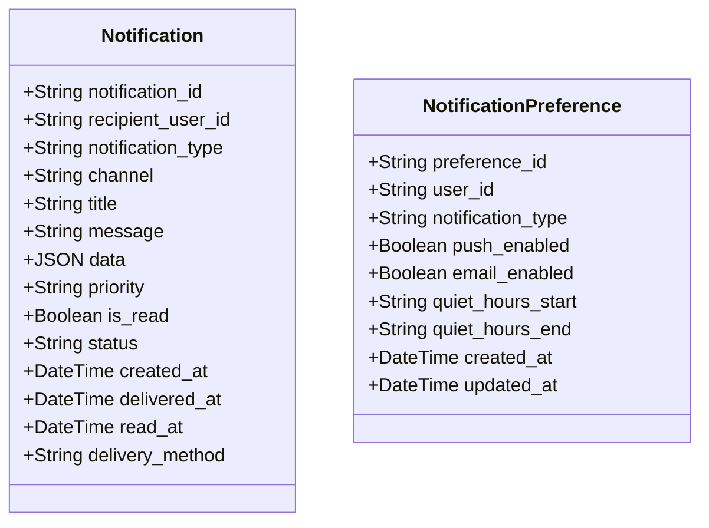
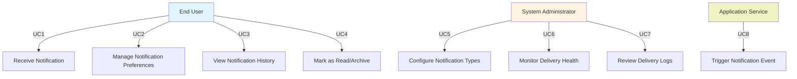
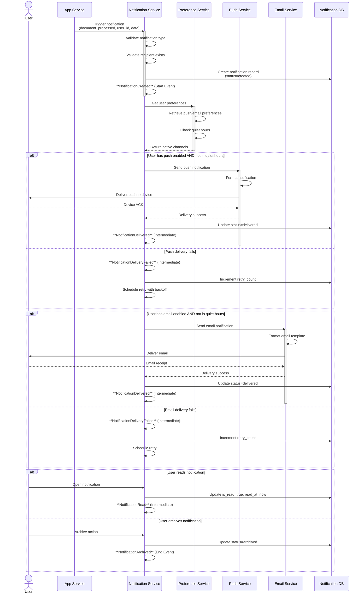

# Notifications System

## Specification

### Entity Definition

#### Notification Entity

**Entity Structure:**



**State Diagram:**

```mermaid
stateDiagram-v2
    [*] --> created: Notification triggered

    created: created
    created: Notification event initiated, queued for delivery

    pending: pending
    pending: Ready to be sent to delivery service

    delivering: delivering
    delivering: Currently being sent to push/email service

    delivered: delivered
    delivered: Successfully delivered to user

    failed: failed
    failed: Delivery failed, may retry

    read: read
    read: User has read the notification

    archived: archived
    archived: Notification archived by user

    created --> pending: Notification validated
    pending --> delivering: Delivery service picked up
    delivering --> delivered: Successfully sent
    delivering --> failed: Delivery service reported failure
    failed --> pending: Retry scheduled
    delivered --> read: User opens and reads notification
    delivered --> archived: User archives notification
    pending --> archived: User archived before delivery
    read --> archived: User archives notification
    [*] <-- archived
    [*] <-- read
```

**Validation Rules:**

- Notification type must be defined in system configuration
- Recipient user ID must exist and be valid
- Title must be between 1-100 characters
- Message must be between 1-1000 characters
- Priority must be one of: low, normal, high, urgent
- Channel must be one of: push_notification, email, in_app
- At least one delivery channel must be enabled for the notification type
- Delivery method must match recipient's enabled preferences
- Quiet hours should not prevent urgent priority notifications
- User preferences must exist before notification delivery attempt

### Use Cases

#### Requirements for Use Cases

- **Only human end users**: Use cases must only include human end users as actors. System components, automated services, background jobs, or internal system processes should NOT be defined as actors
  or use cases.
- **User-focused**: Use cases describe what human users want to accomplish with the system, not how the system internally processes data.
- **System behavior in workflows**: System-level behavior (validation, delivery, retry logic, queueing) should be documented in Business Process Documentation (Activity Flow Diagrams, Event Sequence
  Diagrams) rather than as use cases.
- **Actor definition**: Each actor must be a human role (e.g., User, Administrator, Manager, Customer) with clear business objectives.

#### Actors

**End User**

- **Description**: An individual using the app who performs actions that trigger notifications or views received notifications. Users interact with the system to manage their notification preferences
  and consume notifications through push and email channels.
- **Objectives**:
    - Receive timely notifications when important events occur in the system
    - Choose which types of notifications to receive and through which channels
    - Access and manage their notification history
    - Mark notifications as read or archive them
    - Configure quiet hours to avoid notifications during sleep/work times
    - Receive urgent notifications even during quiet hours

**System Administrator**

- **Description**: A technical administrator responsible for configuring notification types, monitoring notification delivery health, and managing notification system configuration.
- **Objectives**:
    - Define and configure notification types in the system
    - Monitor notification delivery success rates and failure patterns
    - Review delivery logs and diagnose delivery issues
    - Configure system-wide notification settings and limits
    - Manage notification templates and content

**Application Service**

- **Description**: Internal system service that triggers notifications based on application events (document processing, system alerts, etc.).
- **Objectives**:
    - Trigger appropriate notifications when business events occur
    - Provide notification data and context to the notification system
    - Understand which notification types exist and when to use them
    - Respect user notification preferences

#### Use Case Diagram



**Note**: System-level operations (notification queueing, delivery scheduling, retry logic, preference matching, template rendering) are not included as use cases. These are documented in the Business
Process Documentation section (Activity Flow Diagrams, Event Sequence Diagrams) as internal system workflows.

#### Use Case Descriptions

**UC1: Receive Notification**

- **Actor**: End User
- **Objective**: Receive a notification through preferred delivery channel when an important event occurs
- **Description**: When an important event happens in the system (document processing complete, alert triggered, etc.), the user receives a notification through their preferred channel (push
  notification, email, or both). The notification is delivered in real-time if the user is active, or queued for delivery respecting quiet hours preferences.
- **Preconditions**:
    - User account exists in system
    - User has enabled at least one notification delivery channel
    - Notification type is configured in system
    - Event that triggers notification has occurred
- **Postconditions**:
    - Notification is delivered to user via enabled channel(s)
    - Notification record is created in user's notification history
    - Delivery status is recorded (delivered or failed)
- **Main Flow**:
    1. Application service triggers notification event
    2. System checks user's notification preferences
    3. System determines enabled delivery channels
    4. System evaluates quiet hours for non-urgent notifications
    5. Notification is queued for delivery
    6. Notification service sends via push and/or email
    7. User receives notification on device/email
    8. Notification appears in app notification history

**UC2: Manage Notification Preferences**

- **Actor**: End User
- **Objective**: Configure which notifications to receive and through which delivery channels
- **Description**: Users can access notification settings to enable/disable specific notification types and choose their preferred delivery methods (push, email, or both). Users can also configure
  quiet hours to avoid notifications during specific times, with exceptions for urgent notifications.
- **Preconditions**: User has accessed settings or preferences section
- **Postconditions**: User's notification preferences are updated and applied to future notifications
- **Main Flow**:
    1. User navigates to notification preferences
    2. System displays list of available notification types
    3. System shows current preference status for each notification type
    4. User can enable/disable push notifications for specific type
    5. User can enable/disable email notifications for specific type
    6. User can configure quiet hours start and end time
    7. System saves preferences
    8. System applies preferences to future notifications

**UC3: View Notification History**

- **Actor**: End User
- **Objective**: Access and review past notifications and their content
- **Description**: Users can view a history of all notifications they have received, including unread notifications, read notifications, and archived items. History can be filtered by notification
  type and date range.
- **Preconditions**: User has received at least one notification
- **Postconditions**: User views notification history with ability to interact with individual notifications
- **Main Flow**:
    1. User accesses notification history/inbox
    2. System retrieves user's notifications
    3. System displays notifications sorted by date (newest first)
    4. System shows unread status indicator
    5. User can filter by notification type
    6. User can filter by date range
    7. User can search notifications
    8. User can click individual notification to view full content

**UC4: Mark as Read/Archive**

- **Actor**: End User
- **Objective**: Manage notification status by marking as read or archiving
- **Description**: Users can mark individual notifications as read to indicate they've consumed the content, or archive notifications to remove them from their inbox. Archived notifications can still
  be accessed through history search.
- **Preconditions**:
    - Notification exists in user's inbox
    - User has received the notification
- **Postconditions**:
    - Notification status is updated to read or archived
    - Notification visibility in inbox is updated
- **Main Flow**:
    1. User views notification in history or notification center
    2. User selects "Mark as Read" or "Archive" action
    3. System updates notification status
    4. System removes from unread count if applicable
    5. System hides archived notification from active inbox
    6. User sees confirmation of action

**UC5: Configure Notification Types**

- **Actor**: System Administrator
- **Objective**: Define notification types available in the system
- **Description**: Administrators configure which notification types exist in the system, including their display names, descriptions, default channels, and whether they should respect quiet hours.
  This determines what types of notifications the system can trigger.
- **Preconditions**: Administrator has system configuration access
- **Postconditions**: New notification type is available for system to trigger
- **Main Flow**:
    1. Administrator accesses notification configuration interface
    2. System displays current notification types
    3. Administrator selects option to create new notification type
    4. Administrator enters notification type code (e.g., "document_processed")
    5. Administrator enters user-friendly display name
    6. Administrator enters description
    7. Administrator specifies default delivery channels
    8. Administrator specifies if quiet hours should be respected
    9. System saves notification type configuration
    10. New type available for application services to trigger

**UC6: Monitor Delivery Health**

- **Actor**: System Administrator
- **Objective**: Monitor the health and success rates of notification delivery
- **Description**: Administrators can view dashboard metrics on notification delivery performance including success rates by channel, failure rates, average delivery times, and queue status. This
  allows proactive identification of delivery issues.
- **Preconditions**: Administrator has monitoring access
- **Postconditions**: Administrator has visibility into delivery metrics
- **Main Flow**:
    1. Administrator accesses notification health dashboard
    2. System aggregates delivery metrics
    3. System displays overall delivery success rate
    4. System displays push notification success/failure rates
    5. System displays email delivery success/failure rates
    6. System displays queue status and processing rate
    7. System displays average delivery latency
    8. Administrator reviews metrics for anomalies

**UC7: Review Delivery Logs**

- **Actor**: System Administrator
- **Objective**: Investigate delivery failures and identify issues with notification delivery
- **Description**: Administrators can access detailed logs of notification delivery attempts, including success/failure status, error messages, retry attempts, and user recipient information. This
  helps diagnose why notifications failed to deliver.
- **Preconditions**: Notification delivery attempts have been logged
- **Postconditions**: Administrator has detailed information about delivery issues
- **Main Flow**:
    1. Administrator accesses delivery logs interface
    2. System displays recent delivery log entries
    3. Administrator can filter by status (delivered, failed, pending)
    4. Administrator can filter by date range
    5. Administrator can search by user ID or notification type
    6. System displays error messages for failed deliveries
    7. System displays retry attempt count
    8. Administrator analyzes patterns to identify issues

**UC8: Trigger Notification Event**

- **Actor**: Application Service
- **Objective**: Initiate a notification to be sent when a significant event occurs
- **Description**: When important events happen in the application (document processing complete, system alert, etc.), application services trigger notifications to relevant users. The service
  provides the notification type, recipient, and contextual data.
- **Preconditions**:
    - Notification type is defined in system
    - Event has occurred in application
    - Recipient user ID is available
- **Postconditions**:
    - Notification is queued for delivery
    - Notification record is created
    - System begins delivery process
- **Main Flow**:
    1. Application event occurs (e.g., document processing completes)
    2. Application service calls notification API
    3. Service provides notification_type (e.g., "document_processed")
    4. Service provides recipient user ID
    5. Service provides notification data/context
    6. System validates notification type exists
    7. System validates recipient user exists
    8. System creates notification record
    9. System queues notification for delivery

### Acceptance Criteria

#### Requirements for Acceptance Criteria Management

- **Never re-number acceptance criteria once created**: Once an acceptance criteria (AC) has been assigned an ID (e.g., AC 1, AC 2), that ID must remain permanent. Do not renumber existing acceptance
  criteria even if others are added, removed, or reordered.

- **Never delete acceptance criteria once created**: If an acceptance criteria is no longer needed or becomes obsolete, mark it as deprecated rather than deleting it. Use the following format:
    - `- [ ] ~~AC X - Scenario: [description]~~ (DEPRECATED)`
    - Or add a deprecation note explaining why it's deprecated and when it was deprecated

#### Acceptance Criteria Scenarios

##### Feature: Notification Delivery

```gherkin
- [ ] AC 1 - Scenario: Successfully deliver push notification to user
  Given a user has enabled push notifications for "document_processed" notification type
  And the user is logged into the app
  And the "document_processed" notification type is configured in the system
  When a document completes processing
  Then the Notification entity should create a new notification record
  And the Notification entity should transition to "pending" state through a validated state transition method
  And the Notification entity should raise a "NotificationCreated" domain event with recipient and delivery method
  And the notification delivery service should send a push notification
  And the user should receive the notification on their mobile device
  And the Notification entity should transition from "pending" to "delivered" upon push service confirmation

- [ ] AC 2 - Scenario: Successfully deliver email notification to user
  Given a user has enabled email notifications for "alert_triggered" notification type
  And the "alert_triggered" notification type is configured in the system
  When a system alert is triggered
  Then the Notification entity should create a new notification record
  And the Notification entity should transition to "pending" state
  And the notification delivery service should send an email notification
  And the user should receive the notification in their email inbox
  And the Notification entity should transition from "pending" to "delivered" upon email service confirmation

- [ ] AC 3 - Scenario: Deliver through multiple channels based on user preference
  Given a user has enabled both push and email for "document_processed" notification type
  And the "document_processed" notification type is configured to support both channels
  When a document completes processing
  Then the Notification entity should create a new notification record
  And the notification delivery service should send via push notification
  And the notification delivery service should send via email
  And the user should receive notifications on both channels
```

##### Feature: Notification Preferences

```gherkin
- [ ] AC 4 - Scenario: User disables specific notification type
  Given a user has push notifications enabled for "document_processed"
  When the user navigates to notification preferences
  And the user disables push notifications for "document_processed"
  Then the NotificationPreference entity should update the preference record
  And subsequent "document_processed" notifications should not be delivered via push
  And the user should not receive push notifications for that type

- [ ] AC 5 - Scenario: User configures quiet hours
  Given a user is in notification preferences
  When the user sets quiet hours from 22:00 to 08:00
  And the user marks quiet hours as applicable to all notification types
  Then the NotificationPreference entity should record quiet hours
  And notifications with priority "low" or "normal" should not be delivered during quiet hours
  And notifications with priority "urgent" should still be delivered during quiet hours

- [ ] AC 6 - Scenario: Urgent notifications bypass quiet hours
  Given a user has quiet hours configured from 22:00 to 08:00
  And a system alert with priority "urgent" is triggered at 23:00
  When the system attempts to deliver the notification
  Then the Notification entity should recognize the "urgent" priority level
  And the Notification entity should bypass quiet hours restriction
  And the notification should be delivered immediately regardless of quiet hours
```

##### Feature: Notification History and Management

```gherkin
- [ ] AC 7 - Scenario: User marks notification as read
  Given a user has received a notification
  And the notification is in "delivered" state with is_read = false
  When the user opens the notification
  Then the Notification entity should transition to "read" state through a validated state transition method
  And the Notification entity should record the read_at timestamp
  And the Notification entity should raise a "NotificationRead" domain event
  And the notification should no longer appear in unread notifications

- [ ] AC 8 - Scenario: User archives notification
  Given a user has received a notification
  And the notification is in "delivered" or "read" state
  When the user selects archive action
  Then the Notification entity should transition to "archived" state
  And the Notification entity should raise a "NotificationArchived" domain event
  And the notification should not appear in active inbox
  But the notification should still be accessible through history search

- [ ] AC 9 - Scenario: User views notification history
  Given a user has received multiple notifications
  When the user accesses notification history
  Then the system should retrieve all notifications for the user
  And the system should sort notifications by created_at descending
  And the system should display notification title, message, and timestamp
  And the system should show unread indicator for non-read notifications
  And the user should be able to filter by notification_type
  And the user should be able to filter by date range
```

##### Feature: Notification Delivery Failure and Retry

```gherkin
- [ ] AC 10 - Scenario: Handle failed push notification delivery
  Given the push notification service is temporarily unavailable
  And a notification is queued for delivery
  When the delivery service attempts to send the notification
  Then the Notification entity should record the delivery failure
  And the Notification entity should transition to "failed" state through a validated state transition method
  And the Notification entity should raise a "NotificationDeliveryFailed" domain event
  And the system should schedule a retry attempt
  And the notification should be retried according to retry policy

- [ ] AC 11 - Scenario: Retry failed notification after service recovery
  Given a notification is in "failed" state
  And the retry interval has elapsed
  When the retry service picks up the notification
  Then the notification should attempt delivery again
  And if delivery succeeds, the Notification entity should transition to "delivered" state
  And if delivery fails again, the entity should remain in "failed" state with updated retry count
  And after maximum retries exceeded, the notification should move to "archived" state with failure recorded

- [ ] AC 12 - Scenario: Email delivery failure and retry
  Given an email delivery attempt fails (invalid email, service error, etc.)
  When the system logs the failure
  Then the Notification entity should record the failure with error_message
  And the system should schedule email retry with exponential backoff
  And if email eventually succeeds, status should update to "delivered"
  And if email never succeeds after max retries, user should not receive notification via email
```

##### Feature: Notification System Configuration

```gherkin
- [ ] AC 13 - Scenario: System validates notification type exists
  Given a notification type "document_processed" is not configured in the system
  When an application service attempts to trigger this notification type
  Then the system should reject the notification creation
  And the system should raise a "NotificationTypeNotFound" error
  And the application service should receive error response

- [ ] AC 14 - Scenario: System applies default channel preferences
  Given a notification type "welcome_email" is configured to default to email only
  And a new user has not yet configured notification preferences
  When the system delivers this notification type to the new user
  Then the system should use the notification type's default channels
  And the notification should be delivered via email only
  And the user can later override this in their preferences

- [ ] AC 15 - Scenario: System validates recipient user exists
  Given a notification is triggered for user_id "invalid_user_123"
  And this user does not exist in the system
  When the system attempts to create the notification
  Then the system should reject notification creation
  And the system should log the error with invalid user_id
  And the notification should not be queued for delivery
```

##### Feature: Push Notification Specifics

```gherkin
- [ ] AC 16 - Scenario: Push notification displays correctly on mobile device
  Given a user has push notifications enabled
  When a notification with title "Document Processed" and message "Your file is ready" is triggered
  Then the push notification should display on the user's mobile device
  And the notification should show the title as primary text
  And the notification should show the message as secondary text
  And the notification should include app icon and badge
  And tapping the notification should open the app

- [ ] AC 17 - Scenario: Handle missing or invalid device token
  Given a user's push notification device token is no longer valid
  When the system attempts to deliver a push notification
  Then the delivery service should detect invalid token
  And the Notification entity should record delivery failure
  And the system should mark the device token as invalid
  And the system should remove invalid token from user's device list
```

##### Feature: Email Notification Specifics

```gherkin
- [ ] AC 18 - Scenario: Email notification contains required content
  Given an email notification is queued for delivery
  When the email is formatted and sent
  Then the email should include:
    And valid "From" header with app name/email
    And "To" header with recipient's email address
    And descriptive "Subject" line
    And HTML body with notification title and message
    And Action link or call-to-action button if applicable
    And Unsubscribe option in footer
    And Notification preference link to manage subscriptions

- [ ] AC 19 - Scenario: Track email bounce and invalid address
  Given a user has email address "invalid-email@test.invalid"
  When the system attempts to send email notification
  Then the email delivery service should detect bounce/invalid address
  And the Notification entity should record delivery failure with bounce reason
  And the system should mark email address as invalid
  And the system should disable email notifications for this user until address is verified
```

### Business Process Documentation

#### Business Events

- **Event: NotificationCreated**
    - **Event Type**: Start Event
    - **Trigger**: Application service triggers notification for business event
    - **Payload**:
        - `notification_id`: String - Unique notification identifier
        - `recipient_user_id`: String - User receiving the notification
        - `notification_type`: String - Type of notification (document_processed, alert_triggered, etc.)
        - `title`: String - Notification title
        - `message`: String - Notification message/body
        - `data`: JSON - Additional context data
        - `priority`: String - low, normal, high, urgent
        - `created_at`: DateTime - When notification was created
    - **Consumers**: Preference matching service, delivery scheduler
    - **Business Context**: Represents the initiation of notification delivery workflow

- **Event: NotificationDeliveryScheduled**
    - **Event Type**: Intermediate Event
    - **Trigger**: Notification is validated and ready for delivery
    - **Payload**:
        - `notification_id`: String - Unique notification identifier
        - `recipient_user_id`: String - Recipient user
        - `delivery_channels`: Array[String] - [push, email, in_app]
        - `scheduled_at`: DateTime - When scheduled for delivery
        - `respect_quiet_hours`: Boolean - Whether to respect quiet hours
    - **Consumers**: Delivery service, channel-specific handlers
    - **Business Context**: Notification ready for sending, queued for delivery

- **Event: NotificationDelivered**
    - **Event Type**: Intermediate Event
    - **Trigger**: Notification successfully delivered to recipient
    - **Payload**:
        - `notification_id`: String - Unique notification identifier
        - `delivery_channel`: String - Which channel delivered (push/email)
        - `delivered_at`: DateTime - When delivery confirmed
    - **Consumers**: Notification history service, analytics
    - **Business Context**: Confirms successful delivery

- **Event: NotificationDeliveryFailed**
    - **Event Type**: Intermediate Event
    - **Trigger**: Delivery attempt failed, retry scheduled
    - **Payload**:
        - `notification_id`: String - Unique notification identifier
        - `delivery_channel`: String - Which channel failed
        - `error_message`: String - Reason for failure
        - `retry_count`: Integer - Number of retry attempts
        - `next_retry_at`: DateTime - When next retry scheduled
    - **Consumers**: Retry scheduler, monitoring service
    - **Business Context**: Delivery failed but may be retried

- **Event: NotificationRead**
    - **Event Type**: Intermediate Event
    - **Trigger**: User opens and reads notification
    - **Payload**:
        - `notification_id`: String - Unique notification identifier
        - `read_at`: DateTime - When user read notification
    - **Consumers**: User engagement analytics
    - **Business Context**: User consumed notification

- **Event: NotificationArchived**
    - **Event Type**: End Event
    - **Trigger**: User archives notification
    - **Payload**:
        - `notification_id`: String - Unique notification identifier
        - `archived_at`: DateTime - When archived
    - **Consumers**: Notification history service
    - **Business Context**: Notification lifecycle complete

#### Activity Flow Diagram

```mermaid
flowchart TD
    Start([Start]) --> NotificationCreated["NotificationCreated<br/>Start Event<br/>(App Service triggers)"]
    NotificationCreated -->|Notification event received| ValidateNotification["Validate Notification"]
    ValidateNotification -->|Check type exists, recipient valid| ValidationDecision{Validation<br/>Result?}

    ValidationDecision -->|Invalid| HandleValidationError["Handle Validation Error"]
    HandleValidationError -->|Log error| End1([End - Error])

    ValidationDecision -->|Valid| RetrievePreferences["Retrieve User Preferences"]
    RetrievePreferences -->|Get notification prefs| CheckChannels{Channels<br/>Enabled?}

    CheckChannels -->|No channels enabled| SkipDelivery["Mark as Complete<br/>No delivery needed"]
    SkipDelivery --> End2([End])

    CheckChannels -->|Channels enabled| EvaluateQuietHours{"Priority = Urgent<br/>OR<br/>Outside Quiet Hours?"}

    EvaluateQuietHours -->|Yes, deliver now| DetermineChannels["Determine Active<br/>Delivery Channels"]
    EvaluateQuietHours -->|No, schedule later| ScheduleQuietHours["Schedule for Quiet<br/>Hour end time"]
    ScheduleQuietHours --> DetermineChannels

    DetermineChannels -->|Channels: push/email| NotificationScheduled["NotificationDeliveryScheduled<br/>Intermediate Event"]
    NotificationScheduled -->|Queue for delivery| QueueNotification["Queue Notification<br/>in Delivery Queue"]

    QueueNotification -->|Process queue| DeliverPush{"Deliver<br/>Push?"}
    DeliverPush -->|Yes| SendPushService["Send to Push<br/>Service"]
    SendPushService --> PushSuccess{Push<br/>Success?}

    PushSuccess -->|Yes| DeliveredPush["NotificationDelivered<br/>Intermediate Event"]
    DeliveredPush --> TrackPushSuccess["Update Status:<br/>Delivered"]

    PushSuccess -->|No| DeliveryFailedPush["NotificationDeliveryFailed<br/>Intermediate Event"]
    DeliveryFailedPush --> ScheduleRetry["Schedule Retry<br/>with backoff"]
    ScheduleRetry --> MaxRetries{Max Retries<br/>Exceeded?}
    MaxRetries -->|No| RequeuePush["Requeue for<br/>Next Attempt"]
    MaxRetries -->|Yes| ArchiveFailure["Archive as<br/>Failed"]

    DeliverPush -->|No| DeliverEmail{"Deliver<br/>Email?"}
    DeliverEmail -->|Yes| SendEmailService["Send to Email<br/>Service"]
    SendEmailService --> EmailSuccess{Email<br/>Success?}

    EmailSuccess -->|Yes| DeliveredEmail["NotificationDelivered<br/>Intermediate Event"]
    DeliveredEmail --> TrackEmailSuccess["Update Status:<br/>Delivered"]

    EmailSuccess -->|No| DeliveryFailedEmail["NotificationDeliveryFailed<br/>Intermediate Event"]
    DeliveryFailedEmail --> ScheduleEmailRetry["Schedule Email<br/>Retry"]

    DeliverEmail -->|No| AllChannelsProcessed["All Channels<br/>Processed"]
    TrackPushSuccess --> AllChannelsProcessed
    TrackEmailSuccess --> AllChannelsProcessed
    RequeuePush --> AllChannelsProcessed
    ScheduleEmailRetry --> AllChannelsProcessed
    ArchiveFailure --> AllChannelsProcessed

    AllChannelsProcessed --> AwaitUserInteraction["Await User<br/>Interaction"]
    AwaitUserInteraction -->|User reads| UserReadsNotification["NotificationRead<br/>Intermediate Event"]
    UserReadsNotification --> MarkRead["Mark as Read"]
    MarkRead --> FinalState

    AwaitUserInteraction -->|User archives| UserArchives["NotificationArchived<br/>End Event"]
    UserArchives --> FinalState["Mark as Archived<br/>Lifecycle Complete"]
    FinalState --> End3([End])
```



#### Event Sequence Diagram



### Contracts and APIs

#### REST API Contract

**OpenAPI Specification:**

```yaml
openapi: 3.1.0
info:
  title: Notifications API
  version: 1.0.0
  description: API for managing and delivering notifications

paths:
  /api/v1/notifications/trigger:
    post:
      summary: Trigger a notification for a user
      description: Create and queue a notification for delivery to a user
      tags:
        - Notifications
      requestBody:
        required: true
        content:
          application/json:
            schema:
              $ref: '#/components/schemas/TriggerNotificationRequest'
      responses:
        '201':
          description: Notification created successfully
          content:
            application/json:
              schema:
                $ref: '#/components/schemas/NotificationResponse'
        '400':
          description: Validation error
          content:
            application/json:
              schema:
                $ref: '#/components/schemas/ErrorResponse'
        '404':
          description: Notification type or user not found
          content:
            application/json:
              schema:
                $ref: '#/components/schemas/ErrorResponse'
      security:
        - bearerAuth: []

  /api/v1/notifications:
    get:
      summary: Get user notifications
      description: Retrieve paginated list of notifications for authenticated user
      tags:
        - Notifications
      parameters:
        - name: limit
          in: query
          schema:
            type: integer
            default: 20
        - name: offset
          in: query
          schema:
            type: integer
            default: 0
        - name: notification_type
          in: query
          schema:
            type: string
          description: Filter by notification type
        - name: status
          in: query
          schema:
            type: string
            enum: [delivered, failed, read, archived]
          description: Filter by status
      responses:
        '200':
          description: List of notifications
          content:
            application/json:
              schema:
                $ref: '#/components/schemas/NotificationListResponse'
      security:
        - bearerAuth: []

  /api/v1/notifications/{notification_id}:
    get:
      summary: Get notification details
      tags:
        - Notifications
      parameters:
        - name: notification_id
          in: path
          required: true
          schema:
            type: string
      responses:
        '200':
          description: Notification details
          content:
            application/json:
              schema:
                $ref: '#/components/schemas/NotificationResponse'
        '404':
          description: Notification not found
      security:
        - bearerAuth: []

    put:
      summary: Update notification status
      tags:
        - Notifications
      parameters:
        - name: notification_id
          in: path
          required: true
          schema:
            type: string
      requestBody:
        required: true
        content:
          application/json:
            schema:
              $ref: '#/components/schemas/UpdateNotificationRequest'
      responses:
        '200':
          description: Notification updated
          content:
            application/json:
              schema:
                $ref: '#/components/schemas/NotificationResponse'
        '404':
          description: Notification not found
      security:
        - bearerAuth: []

  /api/v1/preferences/notifications:
    get:
      summary: Get user notification preferences
      tags:
        - Preferences
      responses:
        '200':
          description: User notification preferences
          content:
            application/json:
              schema:
                $ref: '#/components/schemas/NotificationPreferencesResponse'
      security:
        - bearerAuth: []

    put:
      summary: Update notification preferences
      tags:
        - Preferences
      requestBody:
        required: true
        content:
          application/json:
            schema:
              $ref: '#/components/schemas/UpdatePreferencesRequest'
      responses:
        '200':
          description: Preferences updated
          content:
            application/json:
              schema:
                $ref: '#/components/schemas/NotificationPreferencesResponse'
      security:
        - bearerAuth: []

  /api/v1/admin/notification-types:
    get:
      summary: List all configured notification types
      tags:
        - Admin
      responses:
        '200':
          description: List of notification types
          content:
            application/json:
              schema:
                $ref: '#/components/schemas/NotificationTypeListResponse'
      security:
        - bearerAuth: []

    post:
      summary: Create new notification type
      tags:
        - Admin
      requestBody:
        required: true
        content:
          application/json:
            schema:
              $ref: '#/components/schemas/CreateNotificationTypeRequest'
      responses:
        '201':
          description: Notification type created
          content:
            application/json:
              schema:
                $ref: '#/components/schemas/NotificationTypeResponse'
      security:
        - bearerAuth: []

  /api/v1/admin/delivery-health:
    get:
      summary: Get delivery health metrics
      tags:
        - Admin
      parameters:
        - name: period
          in: query
          schema:
            type: string
            enum: [1h, 24h, 7d]
          default: 24h
      responses:
        '200':
          description: Delivery health metrics
          content:
            application/json:
              schema:
                $ref: '#/components/schemas/DeliveryHealthResponse'
      security:
        - bearerAuth: []

  /api/v1/admin/delivery-logs:
    get:
      summary: Get delivery attempt logs
      tags:
        - Admin
      parameters:
        - name: limit
          in: query
          schema:
            type: integer
            default: 50
        - name: offset
          in: query
          schema:
            type: integer
            default: 0
        - name: status
          in: query
          schema:
            type: string
            enum: [success, failed, pending]
        - name: channel
          in: query
          schema:
            type: string
            enum: [push, email]
      responses:
        '200':
          description: Delivery logs
          content:
            application/json:
              schema:
                $ref: '#/components/schemas/DeliveryLogListResponse'
      security:
        - bearerAuth: []

components:
  securitySchemes:
    bearerAuth:
      type: http
      scheme: bearer
      bearerFormat: JWT

  schemas:
    TriggerNotificationRequest:
      type: object
      required:
        - notification_type
        - recipient_user_id
        - title
        - message
      properties:
        notification_type:
          type: string
          description: Type of notification (must be configured in system)
          example: document_processed
        recipient_user_id:
          type: string
          description: User ID to receive notification
          format: uuid
        title:
          type: string
          description: Notification title
          minLength: 1
          maxLength: 100
          example: Document Ready
        message:
          type: string
          description: Notification message
          minLength: 1
          maxLength: 1000
          example: Your document has been processed and is ready for download
        data:
          type: object
          description: Optional contextual data
          additionalProperties: true
          example:
            document_id: doc-123
            download_url: /api/documents/doc-123/download
        priority:
          type: string
          enum: [low, normal, high, urgent]
          default: normal
          description: Notification priority level

    NotificationResponse:
      type: object
      required:
        - notification_id
        - recipient_user_id
        - notification_type
        - title
        - message
        - status
        - created_at
      properties:
        notification_id:
          type: string
          format: uuid
        recipient_user_id:
          type: string
          format: uuid
        notification_type:
          type: string
        title:
          type: string
        message:
          type: string
        data:
          type: object
          nullable: true
        priority:
          type: string
          enum: [low, normal, high, urgent]
        status:
          type: string
          enum: [created, pending, delivering, delivered, failed, read, archived]
        is_read:
          type: boolean
        created_at:
          type: string
          format: date-time
        delivered_at:
          type: string
          format: date-time
          nullable: true
        read_at:
          type: string
          format: date-time
          nullable: true

    UpdateNotificationRequest:
      type: object
      properties:
        status:
          type: string
          enum: [read, archived]
          description: Update notification status

    NotificationListResponse:
      type: object
      required:
        - notifications
        - total_count
        - limit
        - offset
      properties:
        notifications:
          type: array
          items:
            $ref: '#/components/schemas/NotificationResponse'
        total_count:
          type: integer
        limit:
          type: integer
        offset:
          type: integer

    NotificationPreferencesResponse:
      type: object
      required:
        - user_id
        - preferences
      properties:
        user_id:
          type: string
          format: uuid
        preferences:
          type: array
          items:
            type: object
            required:
              - notification_type
              - push_enabled
              - email_enabled
            properties:
              notification_type:
                type: string
              push_enabled:
                type: boolean
              email_enabled:
                type: boolean
              quiet_hours_start:
                type: string
                pattern: '^\d{2}:\d{2}$'
                nullable: true
                description: Quiet hours start time (HH:MM)
              quiet_hours_end:
                type: string
                pattern: '^\d{2}:\d{2}$'
                nullable: true
                description: Quiet hours end time (HH:MM)

    UpdatePreferencesRequest:
      type: object
      properties:
        notification_type:
          type: string
        push_enabled:
          type: boolean
        email_enabled:
          type: boolean
        quiet_hours_start:
          type: string
          pattern: '^\d{2}:\d{2}$'
        quiet_hours_end:
          type: string
          pattern: '^\d{2}:\d{2}$'

    NotificationTypeResponse:
      type: object
      required:
        - notification_type_code
        - display_name
        - description
        - default_channels
        - respects_quiet_hours
      properties:
        notification_type_code:
          type: string
          example: document_processed
        display_name:
          type: string
          example: Document Processed
        description:
          type: string
          example: Notification sent when a document finishes processing
        default_channels:
          type: array
          items:
            type: string
            enum: [push, email]
          example: [push, email]
        respects_quiet_hours:
          type: boolean
          description: Whether notifications of this type respect user quiet hours
          example: true

    CreateNotificationTypeRequest:
      type: object
      required:
        - notification_type_code
        - display_name
        - description
        - default_channels
        - respects_quiet_hours
      properties:
        notification_type_code:
          type: string
        display_name:
          type: string
        description:
          type: string
        default_channels:
          type: array
          items:
            type: string
            enum: [push, email]
        respects_quiet_hours:
          type: boolean

    NotificationTypeListResponse:
      type: object
      required:
        - notification_types
      properties:
        notification_types:
          type: array
          items:
            $ref: '#/components/schemas/NotificationTypeResponse'

    DeliveryHealthResponse:
      type: object
      required:
        - period
        - total_notifications
        - successful_deliveries
        - failed_deliveries
        - success_rate
        - by_channel
      properties:
        period:
          type: string
          enum: [1h, 24h, 7d]
        total_notifications:
          type: integer
        successful_deliveries:
          type: integer
        failed_deliveries:
          type: integer
        success_rate:
          type: number
          format: float
          description: Percentage 0-100
        average_delivery_time_ms:
          type: integer
        queue_length:
          type: integer
        by_channel:
          type: object
          properties:
            push:
              type: object
              properties:
                total:
                  type: integer
                successful:
                  type: integer
                failed:
                  type: integer
                success_rate:
                  type: number
            email:
              type: object
              properties:
                total:
                  type: integer
                successful:
                  type: integer
                failed:
                  type: integer
                success_rate:
                  type: number

    DeliveryLogListResponse:
      type: object
      required:
        - logs
        - total_count
      properties:
        logs:
          type: array
          items:
            type: object
            required:
              - log_id
              - notification_id
              - channel
              - status
              - attempted_at
            properties:
              log_id:
                type: string
                format: uuid
              notification_id:
                type: string
                format: uuid
              recipient_user_id:
                type: string
                format: uuid
              channel:
                type: string
                enum: [push, email]
              status:
                type: string
                enum: [success, failed, pending]
              error_message:
                type: string
                nullable: true
              retry_count:
                type: integer
              attempted_at:
                type: string
                format: date-time
        total_count:
          type: integer

    ErrorResponse:
      type: object
      required:
        - error
      properties:
        error:
          type: object
          required:
            - code
            - message
          properties:
            code:
              type: string
              example: INVALID_NOTIFICATION_TYPE
            message:
              type: string
              example: Notification type 'invalid_type' is not configured in the system
            details:
              type: object
              nullable: true
              additionalProperties: true
```

### E2E Test Cases

- [ ] **Notification Delivery - Happy Path**: Trigger "document_processed" → User receives push + email → Both channels confirmed delivered
- [ ] **Push Notification Only**: User disables email → Trigger notification → Only push delivered, not email
- [ ] **Email Notification Only**: User disables push → Trigger notification → Only email delivered, not push
- [ ] **Quiet Hours Enforcement - Normal Priority**: Set quiet hours 22:00-08:00 → Trigger "normal" priority at 23:00 → Notification queued until 08:00
- [ ] **Urgent Bypasses Quiet Hours**: Set quiet hours 22:00-08:00 → Trigger "urgent" priority at 23:00 → Notification delivered immediately
- [ ] **Mark as Read**: Receive notification → Open in app → Mark as read → Status changes to read, timestamp recorded
- [ ] **Archive Notification**: Receive notification → Archive → No longer in inbox, but accessible in history
- [ ] **Failed Delivery Retry**: Push service fails → Retry scheduled → Service recovers → Notification delivered on retry
- [ ] **Email Bounce Handling**: Send to invalid email → Bounce detected → Disable email for user → User can re-enable with new email
- [ ] **Notification Type Not Found**: Trigger undefined type → System rejects → Error returned to caller
- [ ] **User Not Found**: Trigger notification for non-existent user → System rejects → Error logged
- [ ] **Preference Filtering**: Trigger notification but user has type disabled → No delivery attempt → Notification marked complete
- [ ] **Multiple Notifications**: Send 3 different notifications → All queued → All delivered → All appear in history
- [ ] **Notification History Pagination**: User has 100+ notifications → Request page 1 (20 items) → Correct subset returned
- [ ] **Filter History by Type**: User has mixed notification types → Filter by "document_processed" → Only that type displayed
- [ ] **Admin Create Notification Type**: Admin creates new type "workflow_started" → Can be triggered immediately → Users see in preferences
- [ ] **Admin Monitor Health**: Check delivery dashboard → Shows success rates by channel → Metrics accurate
- [ ] **Admin Review Logs**: Check delivery logs → Filter by failed status → Shows only failures with error messages
- [ ] **Performance Test**: Trigger 1000 notifications concurrently → All queued → Delivered within SLA → No data loss
- [ ] **Device Token Management**: First notification succeeds → Device token valid → Second notification succeeds → Invalid token detected → Subsequent deliveries use new token
