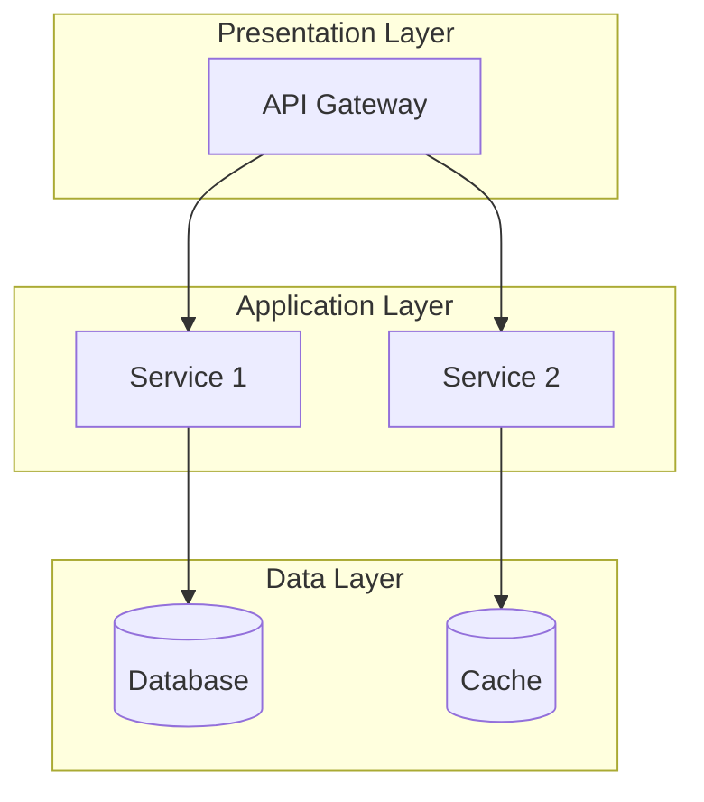
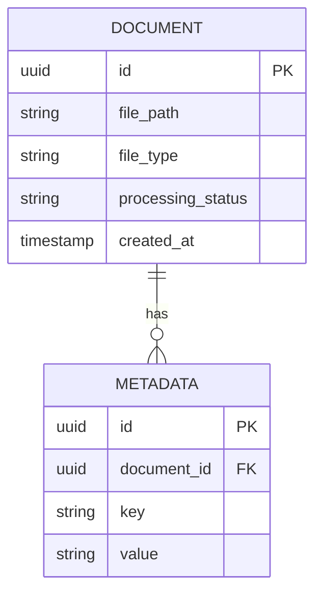
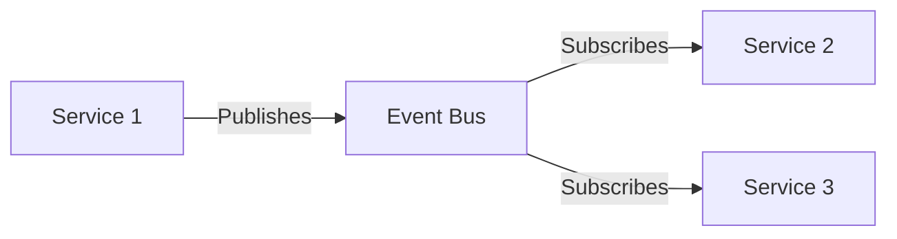
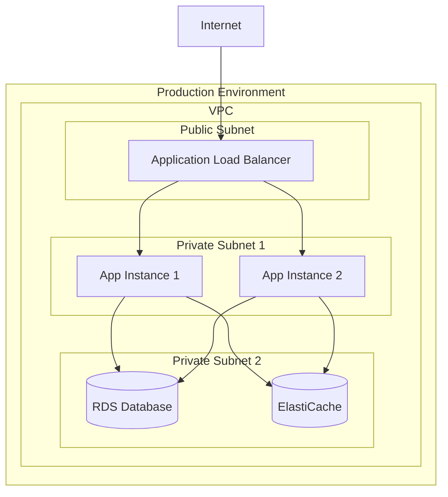
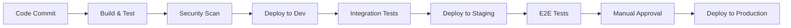

# {Feature Name} - Technical Architecture Specification

## System Overview

[Provide a high-level overview of the system architecture for this feature. Explain the architectural approach, key design decisions, and how this feature integrates with the existing system architecture.]

## System Architecture

### Architecture Diagram

[Include a high-level architecture diagram showing major components, services, data stores, and their relationships]



### Architectural Layers

[Describe the architectural layers and their responsibilities:]
- **Presentation Layer**: API endpoints, controllers, request/response handling
- **Application Layer**: Business logic, domain services, orchestration
- **Domain Layer**: Entities, value objects, domain logic, business rules
- **Infrastructure Layer**: Database access, external integrations, technical services
- **Cross-Cutting Concerns**: Logging, monitoring, security, caching

### Design Patterns and Principles

[Document key architectural patterns used:]
- Domain-Driven Design patterns (if applicable)
- CQRS, Event Sourcing (if applicable)
- Microservices patterns
- Repository pattern
- Factory pattern
- Strategy pattern
- etc.

## Component Design

### Component 1: {Component Name}

**Responsibility**: [What this component does]

**Technology**: [Framework, language, runtime]

**Key Classes/Modules**:
- `ClassName1`: [Purpose and responsibility]
- `ClassName2`: [Purpose and responsibility]

**Dependencies**:
- Internal: [Other components this depends on]
- External: [Third-party libraries, services]

**Configuration**:
```yaml
component:
  setting1: value
  setting2: value
```

### Component 2: {Component Name}

[Repeat structure for each major component]

## Data Architecture

### Database Design

**Database Technology**: [PostgreSQL, MongoDB, etc.]

**Schema Design**:

```sql
-- Example table definitions
CREATE TABLE documents (
    id UUID PRIMARY KEY,
    file_path VARCHAR(500) NOT NULL,
    file_type VARCHAR(10) NOT NULL,
    processing_status VARCHAR(20) NOT NULL,
    created_at TIMESTAMP DEFAULT NOW(),
    updated_at TIMESTAMP DEFAULT NOW()
);

CREATE INDEX idx_documents_status ON documents(processing_status);
CREATE INDEX idx_documents_created ON documents(created_at);
```

**Data Model Diagram**:



**Data Retention and Archival**:
- [Describe data retention policies]
- [Archival strategy for old data]
- [Backup and recovery procedures]

### Caching Strategy

**Cache Technology**: [Redis, Memcached, in-memory, etc.]

**Caching Approach**:
- **Cache-Aside**: [When and what to cache]
- **Write-Through**: [If applicable]
- **TTL Strategy**: [Time-to-live for cached items]

**Cache Invalidation**:
- [When to invalidate cache]
- [Invalidation patterns used]

## Integration Architecture

### Internal Service Communication

**Communication Pattern**: [Synchronous REST, asynchronous messaging, gRPC, etc.]

**Message Bus/Event Bus**: [Technology used - Kafka, RabbitMQ, AWS SNS/SQS, etc.]

**Event-Driven Architecture**:



### External Integrations

**External System 1**: [System name]
- **Integration Type**: [REST API, SOAP, webhook, etc.]
- **Authentication**: [OAuth, API Key, etc.]
- **Error Handling**: [Retry logic, circuit breaker, fallback]
- **Rate Limiting**: [Limits and throttling strategy]

### API Gateway Configuration

**Gateway Technology**: [Kong, AWS API Gateway, nginx, etc.]

**Routing Rules**:
- `/api/v1/documents` → Document Service
- `/api/v1/cache` → Cache Service

**Cross-Cutting Concerns**:
- Rate limiting: [requests per minute]
- Authentication/Authorization
- Request/Response transformation
- Logging and monitoring

## Contracts and APIs

### REST API Specification

**OpenAPI 3.1 Specification**:

```yaml
openapi: 3.1.0
info:
  title: {Feature} API
  version: 1.0.0
  description: API specification for {feature}

servers:
  - url: https://api.example.com/v1
    description: Production server
  - url: https://staging-api.example.com/v1
    description: Staging server

paths:
  /api/v1/resource:
    post:
      summary: Create resource
      operationId: createResource
      tags:
        - Resources
      requestBody:
        required: true
        content:
          application/json:
            schema:
              $ref: '#/components/schemas/CreateResourceRequest'
      responses:
        '201':
          description: Resource created successfully
          content:
            application/json:
              schema:
                $ref: '#/components/schemas/ResourceResponse'
        '400':
          description: Validation error
          content:
            application/json:
              schema:
                $ref: '#/components/schemas/ErrorResponse'
        '401':
          description: Unauthorized
        '500':
          description: Internal server error
      security:
        - bearerAuth: []

    get:
      summary: List resources
      operationId: listResources
      tags:
        - Resources
      parameters:
        - name: page
          in: query
          schema:
            type: integer
            default: 1
        - name: limit
          in: query
          schema:
            type: integer
            default: 20
            maximum: 100
      responses:
        '200':
          description: List of resources
          content:
            application/json:
              schema:
                type: object
                properties:
                  data:
                    type: array
                    items:
                      $ref: '#/components/schemas/ResourceResponse'
                  pagination:
                    $ref: '#/components/schemas/PaginationResponse'

  /api/v1/resource/{id}:
    get:
      summary: Get resource by ID
      operationId: getResource
      tags:
        - Resources
      parameters:
        - name: id
          in: path
          required: true
          schema:
            type: string
            format: uuid
      responses:
        '200':
          description: Resource found
          content:
            application/json:
              schema:
                $ref: '#/components/schemas/ResourceResponse'
        '404':
          description: Resource not found

components:
  securitySchemes:
    bearerAuth:
      type: http
      scheme: bearer
      bearerFormat: JWT

  schemas:
    CreateResourceRequest:
      type: object
      required:
        - field1
        - field2
      properties:
        field1:
          type: string
          minLength: 1
          maxLength: 255
        field2:
          type: string
          enum: [option1, option2, option3]

    ResourceResponse:
      type: object
      required:
        - id
        - field1
        - field2
        - created_at
      properties:
        id:
          type: string
          format: uuid
        field1:
          type: string
        field2:
          type: string
        created_at:
          type: string
          format: date-time
        updated_at:
          type: string
          format: date-time

    ErrorResponse:
      type: object
      required:
        - error
      properties:
        error:
          type: object
          required:
            - code
            - message
          properties:
            code:
              type: string
              description: Error code for programmatic handling
            message:
              type: string
              description: Human-readable error message
            details:
              type: object
              description: Additional error context
              additionalProperties: true

    PaginationResponse:
      type: object
      properties:
        page:
          type: integer
        limit:
          type: integer
        total:
          type: integer
        total_pages:
          type: integer
```

### Message Contracts (Event-Driven)

**Event Schema Specification**:

```yaml
# DocumentUploaded Event
DocumentUploaded:
  type: object
  required:
    - event_id
    - event_type
    - timestamp
    - payload
  properties:
    event_id:
      type: string
      format: uuid
    event_type:
      type: string
      const: "DocumentUploaded"
    timestamp:
      type: string
      format: date-time
    payload:
      type: object
      required:
        - document_id
        - file_path
        - file_type
        - file_size
      properties:
        document_id:
          type: string
          format: uuid
        file_path:
          type: string
        file_type:
          type: string
          enum: [PDF, DOCX, TXT]
        file_size:
          type: integer
          minimum: 0
        metadata:
          type: object
          additionalProperties: true

# DocumentProcessingCompleted Event
DocumentProcessingCompleted:
  type: object
  required:
    - event_id
    - event_type
    - timestamp
    - payload
  properties:
    event_id:
      type: string
      format: uuid
    event_type:
      type: string
      const: "DocumentProcessingCompleted"
    timestamp:
      type: string
      format: date-time
    payload:
      type: object
      required:
        - document_id
        - cached_markdown_path
        - processed_at
      properties:
        document_id:
          type: string
          format: uuid
        cached_markdown_path:
          type: string
        metadata:
          type: object
        processed_at:
          type: string
          format: date-time
```

### GraphQL Schema (if applicable)

```graphql
type Query {
  resource(id: ID!): Resource
  resources(page: Int, limit: Int): ResourceConnection!
}

type Mutation {
  createResource(input: CreateResourceInput!): Resource!
  updateResource(id: ID!, input: UpdateResourceInput!): Resource!
  deleteResource(id: ID!): Boolean!
}

type Resource {
  id: ID!
  field1: String!
  field2: String!
  createdAt: DateTime!
  updatedAt: DateTime!
}

input CreateResourceInput {
  field1: String!
  field2: String!
}

type ResourceConnection {
  edges: [ResourceEdge!]!
  pageInfo: PageInfo!
  totalCount: Int!
}
```

## Technology Stack

### Backend

- **Language**: [Python, Java, TypeScript, Go, etc.]
- **Framework**: [Django, Spring Boot, NestJS, etc.]
- **Runtime**: [Node.js version, Python version, JVM version]

### Data Storage

- **Primary Database**: [PostgreSQL 15, MongoDB 6, etc.]
- **Cache**: [Redis 7, Memcached, etc.]
- **Object Storage**: [AWS S3, MinIO, etc.]
- **Search Engine**: [Elasticsearch, OpenSearch, etc.] (if applicable)

### Infrastructure

- **Container Runtime**: [Docker, containerd]
- **Orchestration**: [Kubernetes, ECS, etc.]
- **Message Queue**: [RabbitMQ, Kafka, AWS SQS, etc.]
- **Service Mesh**: [Istio, Linkerd, etc.] (if applicable)

### Observability

- **Logging**: [ELK Stack, CloudWatch, etc.]
- **Monitoring**: [Prometheus, Grafana, DataDog, etc.]
- **Tracing**: [Jaeger, Zipkin, AWS X-Ray, etc.]
- **APM**: [New Relic, AppDynamics, etc.]

## Security Architecture

### Authentication and Authorization

**Authentication Mechanism**: [JWT, OAuth 2.0, SAML, etc.]

**Authorization Model**: [RBAC, ABAC, etc.]

**Token Management**:
- Token expiration: [duration]
- Refresh token strategy: [if applicable]
- Token storage: [where and how]

### Data Security

**Encryption at Rest**:
- Database encryption: [AES-256, etc.]
- File storage encryption: [method]

**Encryption in Transit**:
- TLS version: [TLS 1.3]
- Certificate management: [Let's Encrypt, ACM, etc.]

**Sensitive Data Handling**:
- PII data masking
- Secret management: [AWS Secrets Manager, HashiCorp Vault, etc.]
- API key rotation strategy

### Security Controls

- Input validation and sanitization
- SQL injection prevention
- XSS prevention
- CSRF protection
- Rate limiting per user/IP
- DDoS mitigation

## Deployment Architecture

### Infrastructure as Code

**IaC Tool**: [Terraform, CloudFormation, Pulumi, etc.]

**Repository Structure**:
```
infrastructure/
├── modules/
│   ├── networking/
│   ├── compute/
│   └── database/
├── environments/
│   ├── dev/
│   ├── staging/
│   └── production/
└── main.tf
```

### Deployment Diagram



### Environments

**Development**:
- Single instance deployment
- In-memory cache
- Development database

**Staging**:
- Production-like configuration
- Scaled-down resources
- Isolated from production

**Production**:
- Multi-AZ deployment
- Auto-scaling enabled
- High availability configuration

### CI/CD Pipeline



**Pipeline Stages**:
1. Code checkout
2. Dependency installation
3. Unit tests
4. Static code analysis
5. Security scanning (SAST, dependency check)
6. Build Docker image
7. Push to container registry
8. Deploy to environment
9. Run integration/E2E tests
10. Smoke tests

## Performance and Scalability

### Performance Requirements

- **API Response Time**: [< 200ms for 95th percentile]
- **Throughput**: [requests per second]
- **Concurrent Users**: [expected concurrent users]
- **Database Query Performance**: [< 100ms for 95th percentile]

### Scalability Strategy

**Horizontal Scaling**:
- Stateless application design
- Load balancer configuration
- Auto-scaling rules:
  - Scale up: CPU > 70% for 5 minutes
  - Scale down: CPU < 30% for 10 minutes
  - Min instances: 2
  - Max instances: 10

**Vertical Scaling**:
- Database instance sizing
- Cache instance sizing

**Database Scaling**:
- Read replicas for read-heavy workloads
- Connection pooling configuration
- Query optimization and indexing strategy

### Caching Strategy

**Multi-Layer Caching**:
1. CDN caching (static assets)
2. Application-level caching (Redis)
3. Database query caching

**Cache Warming**: [Strategy for pre-populating cache]

## Error Handling and Resilience

### Error Handling Strategy

**Error Categories**:
1. **Validation Errors** (400): User input errors
2. **Authentication Errors** (401): Invalid or missing credentials
3. **Authorization Errors** (403): Insufficient permissions
4. **Not Found Errors** (404): Resource doesn't exist
5. **Server Errors** (500): Unexpected errors

**Error Response Format**:
```json
{
  "error": {
    "code": "VALIDATION_ERROR",
    "message": "Invalid input provided",
    "details": {
      "field": "email",
      "reason": "Invalid email format"
    },
    "request_id": "req-123456",
    "timestamp": "2024-01-05T12:00:00Z"
  }
}
```

### Resilience Patterns

**Circuit Breaker**:
- Failure threshold: [5 failures in 10 seconds]
- Open circuit duration: [30 seconds]
- Half-open state: [Try 1 request]

**Retry Logic**:
- Exponential backoff: [1s, 2s, 4s, 8s]
- Max retries: [3]
- Idempotency keys for safe retries

**Timeout Configuration**:
- API request timeout: [30 seconds]
- Database query timeout: [10 seconds]
- External service timeout: [15 seconds]

**Bulkhead Pattern**:
- Isolated thread pools for different operations
- Resource limits per operation type

**Graceful Degradation**:
- Fallback responses when services unavailable
- Cached data when fresh data unavailable
- Feature toggles for non-critical features

## Observability and Monitoring

### Logging Strategy

**Log Levels**:
- ERROR: Application errors requiring attention
- WARN: Potential issues or unexpected behavior
- INFO: Important business events
- DEBUG: Detailed debugging information (dev/staging only)

**Structured Logging Format**:
```json
{
  "timestamp": "2024-01-05T12:00:00Z",
  "level": "INFO",
  "service": "document-service",
  "trace_id": "trace-123",
  "span_id": "span-456",
  "message": "Document processed successfully",
  "context": {
    "document_id": "doc-789",
    "processing_time_ms": 150
  }
}
```

**Log Aggregation**: [ELK, CloudWatch, etc.]

### Monitoring and Alerting

**Key Metrics**:

**Application Metrics**:
- Request rate (requests per second)
- Error rate (errors per second)
- Response time (p50, p95, p99)
- Active connections

**Infrastructure Metrics**:
- CPU utilization
- Memory usage
- Disk I/O
- Network throughput

**Business Metrics**:
- Documents processed per hour
- Cache hit rate
- Processing success rate

**Alerts Configuration**:
```yaml
alerts:
  - name: HighErrorRate
    condition: error_rate > 5%
    duration: 5m
    severity: critical
    notification: [pagerduty, slack]

  - name: HighLatency
    condition: p95_latency > 500ms
    duration: 5m
    severity: warning
    notification: [slack]

  - name: LowCacheHitRate
    condition: cache_hit_rate < 70%
    duration: 15m
    severity: warning
    notification: [email]
```

### Distributed Tracing

**Trace Context Propagation**:
- W3C Trace Context standard
- OpenTelemetry integration

**Trace Sampling**:
- Sample rate: [10% for normal requests, 100% for errors]

## Migration and Rollout Strategy

### Feature Flags

**Feature Toggle Configuration**:
```yaml
features:
  new_document_processing:
    enabled: false
    rollout_percentage: 0
    environments:
      dev: 100%
      staging: 100%
      production: 0%
```

### Rollout Plan

**Phase 1: Internal Testing** (Week 1)
- Deploy to development environment
- Internal QA and testing
- Performance benchmarking

**Phase 2: Canary Deployment** (Week 2)
- Deploy to 5% of production traffic
- Monitor metrics and errors
- Gradual increase to 25%

**Phase 3: Full Rollout** (Week 3)
- Deploy to 100% of production traffic
- Monitor for 48 hours
- Rollback plan ready

### Rollback Strategy

**Automatic Rollback Triggers**:
- Error rate > 10%
- p95 latency > 2x baseline
- Critical infrastructure failure

**Rollback Procedure**:
1. Trigger deployment of previous version
2. Verify rollback successful
3. Communicate to stakeholders
4. Post-mortem analysis

## Data Migration (if applicable)

### Migration Strategy

[Describe approach for migrating existing data]

**Migration Steps**:
1. Schema migration (if needed)
2. Data transformation scripts
3. Validation of migrated data
4. Cutover plan

**Data Validation**:
- Row count verification
- Data integrity checks
- Business rule validation