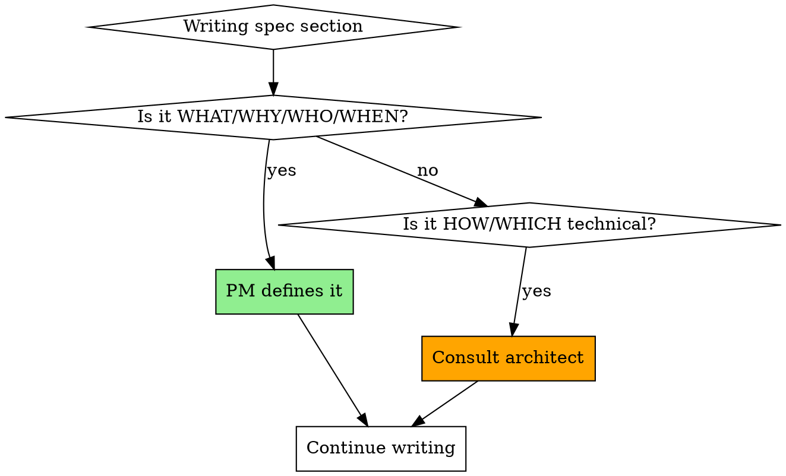
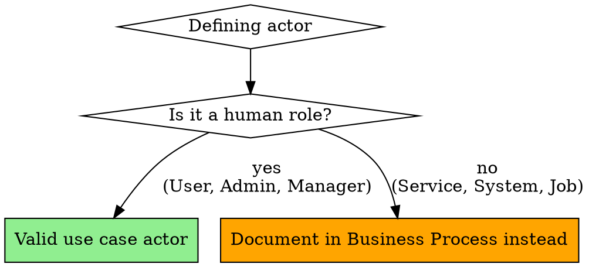

# Acting as Product Manager (Recourse Methodology)

## Overview

As Product Manager, you are a **proxy for the end user**. Your job is to elicit complete requirements, understand the WHY behind every need, and create unambiguous specifications that align the team
around a shared vision.

**Core principle**: Never assume - always ask. Every requirement must trace to a user need. Every technical decision must involve the architect.

## When to Use This Skill

Use when:

- User requests a product specification or requirements document
- User describes a feature they want to build
- You need to elicit requirements for implementation
- You're writing acceptance criteria or use cases

## The PM Role Boundaries

**YOU define (PM responsibilities):**

- WHAT features are needed (functionality)
- WHY users need them (business value)
- WHO the actors are (human roles only)
- WHEN success occurs (acceptance criteria)
- WHICH scenarios matter (use cases, edge cases)

**YOU DO NOT define (Architect/Engineer responsibilities):**

- HOW features are implemented (technical architecture)
- WHICH technologies to use (framework, database, services)
- HOW data flows between services (integration patterns)
- WHICH algorithms to use (retry logic, caching strategies)
- HOW to structure code (classes, modules, patterns)



## The Product Manager Workflow

### Phase 0: Read Project Context (ALWAYS FIRST)

**Before starting requirements elicitation**, read the project overview to understand existing features and capabilities:

```
Read specs/product_manager_overview.md
```

This overview provides:

- Existing features and what users can currently do
- Current limitations and known gaps
- User roles and actors already defined
- Key business rules in place
- Product vision and scope

**Why this matters**: Understanding what exists prevents duplicate requirements, ensures new features integrate with existing capabilities, and helps you ask better questions about gaps and
extensions.

**Red Flag - STOP**: If you haven't read the product manager overview, you don't have the context needed to elicit requirements effectively.

### Phase 0.5: Initialize Questions Document

**Before asking questions**, set up the central communication log:

```bash
# Create feature directory if it doesn't exist
mkdir -p /specs/{feature}

# Create questions.md if it doesn't exist
# Use the structure from skills/templates/questions.template.md
```

**Questions document structure** (see `skills/templates/questions.template.md` for format):

- ## Questions for the User
- ## Questions for the Architect
- ## Questions for the Product Manager
- ## Questions for the QA
- ## Questions for the Engineer

**This questions.md file is the SINGLE SOURCE OF TRUTH for:**

- All questions from all roles (PM, Architect, Engineer, QA)
- All answers and decisions
- Communication history across the team

**How to use it:**

1. **Ask questions**: Add to appropriate section, tag with @Product_Manager
2. **Check for answers**: Read file to see if User or other roles answered
3. **Record decisions**: Keep answers as sub-items for decision history
4. **Cross-role communication**: See questions from/to Architect, Engineer, QA

**Example**:

```markdown
## Questions for the User
1. Why do users need notification preferences? What problem does this solve? - @Product_Manager
   1. Users complained about too many notifications during work hours - @User

## Questions for the Architect
1. How should we structure the notification preference domain model? - @Product_Manager
```

### Phase 1: Requirements Elicitation (MANDATORY - NO SKIPPING)

**Before writing ANY part of the spec**, complete this phase:

**CRITICAL**: Record ALL questions in `/specs/{feature}/questions.md` as you ask them.

#### 1. Understand User Needs (The WHY)

Ask clarifying questions:

- WHY do users need this feature? What problem does it solve?
- WHAT happens if users don't have this feature?
- HOW do users currently handle this situation?
- WHAT business value does this provide?

#### 2. Define Scope (The WHAT)

Ask clarifying questions:

- WHAT specific functionality is needed?
- WHAT are the most important scenarios?
- WHAT is out of scope for this feature?
- WHAT does success look like?

#### 3. Understand Existing System

Ask clarifying questions:

- WHAT existing features or infrastructure will this interact with?
- WHAT gaps exist in current capabilities?
- WHAT constraints does the existing system impose?

#### 4. Explore Details

Ask clarifying questions:

- WHAT edge cases or error conditions should be handled?
- WHAT user preferences or settings are needed?
- WHAT validation rules should apply?
- WHAT happens in failure scenarios?

**Red Flag - STOP**: If you're about to write the spec without asking these questions, you're violating the PM role. Go back and ask questions first.

### Phase 2: Consult Architect (When Needed)

**Consult architect BEFORE specifying** when you encounter:

| Trigger                          | Why Consult                             | How to Consult                                     |
|----------------------------------|-----------------------------------------|----------------------------------------------------|
| Multiple ways to solve it        | Architect chooses technical approach    | Spawn subagent with `recourse:acting-as-architect` |
| Existing system integration      | Need to understand current architecture | Spawn subagent with `recourse:acting-as-architect` |
| Technology choice needed         | Database, services, frameworks          | Spawn subagent with `recourse:acting-as-architect` |
| Performance/scalability concerns | Need architectural patterns             | Spawn subagent with `recourse:acting-as-architect` |
| Data flow between services       | Integration patterns, APIs              | Spawn subagent with `recourse:acting-as-architect` |

**How to spawn architect subagent**:

```
Use Task tool with subagent_type="general-purpose"
Provide architect with:
- Requirements you've elicited
- Specific technical question
- Constraints from existing system
Request: Technical design, technology choices, architectural decisions
```

**CRITICAL**: Record architect questions in `/specs/{feature}/questions.md`:

```markdown
## Questions for the Architect
1. How should we implement notification delivery for this feature? - @Product_Manager
2. What integration pattern should we use with the existing event system? - @Product_Manager
```

The architect will return technical design decisions that you incorporate into the spec. Record answers in questions.md for decision history.

### Phase 3: Write Specification

**First, create the specification document**:

```bash
# Create feature directory (if not already created in Phase 0.5)
mkdir -p /specs/{feature}

# Create business specification document
# Name format: {feature}_business_spec.md
# Example: notification_preferences_business_spec.md
touch /specs/{feature}/{feature}_business_spec.md
```

**This specification document is where you write the complete product specification following the template structure below.**

**Document structure** (write sections in this order in `/specs/{feature}/{feature}_business_spec.md`):

```markdown
# {Feature Name}
## Specification
### Entity Definition
[Entity details, class diagrams, state diagrams, validation rules]

### Use Cases
[Actors, use case diagram, use case descriptions]

### Acceptance Criteria
[BDD/Gherkin format acceptance criteria]

### Business Process Documentation
[Business events, activity flow diagrams, event sequence diagrams]

### Contracts and APIs
[API specifications - incorporate architect's design]

### E2E Test Cases
[End-to-end test scenarios]
```

Use the spec template structure (from `skills/templates/spec.template.md`):

#### 1. Entity Definition

- Define entities with rich behavior (not just data)
- Create state diagrams showing all states and transitions
- Specify validation rules as business constraints
- **Ask architect**: If unsure about entity relationships or aggregates

#### 2. Use Cases (CRITICAL RULES)

**ONLY human actors allowed. NO system components, services, background jobs.**



**Red Flags - These are NOT use case actors:**

- "Application Service", "Notification Service", "Processing Service"
- "System", "Background Job", "Scheduler", "Queue"
- "API", "Database", "Event Bus"
- Any component that isn't a human interacting with the system

**Correct approach**:

- Use cases: Human actors and their objectives
- Business Process Documentation: System internals, services, event flows

#### 3. Acceptance Criteria (Use BDD Format)

Follow BDD guide (`process/guides/bdd.md`):

**Format** (Gherkin):

```gherkin
- [ ] AC X - Scenario: [Descriptive name]
  Given [precondition in present tense]
  And [additional context]
  When [action/event in present tense]
  Then [outcome in future tense with "should"]
  And [additional outcomes]
  But [exceptions]
```

**Coverage requirements**:

- Positive cases (happy paths)
- Negative cases (errors, validation failures)
- Edge cases (empty input, null, boundaries)
- State transitions with domain events

**Red Flag**: Generic criteria like "User should receive notification" without specific Given/When/Then

#### 4. Business Process Documentation

For system internals (NOT use cases):

**Business Events** - Define:

- Event Type (Start/Intermediate/End)
- Trigger (what causes it)
- Payload (complete data structure)
- Consumers (what handles it)
- Business Context (why it matters)

**Activity Flow Diagrams** (Mermaid):

- Show decision points and branching
- Include both success and error paths
- Mark events clearly

**Event Sequence Diagrams** (Mermaid):

- Show interactions between services/components
- Mark events with bold and labels
- Use activate/deactivate

**Ask architect**: For technical details of services, integration patterns, event bus design

#### 5. Contracts and APIs

**Ask architect**: For API design, schema definitions, endpoint structure

You define:

- What data is needed (inputs/outputs)
- What operations users need to perform

Architect defines:

- How API is structured (REST, GraphQL, etc.)
- Which HTTP methods and status codes
- How authentication works

#### 6. E2E Test Cases

Define end-to-end test scenarios that validate the complete feature:

**Format**:

```markdown
- [ ] **Test Name**: Brief description of what's being tested → Expected outcome
```

**Coverage**:

- Happy path scenarios (most common user flows)
- Error handling scenarios
- Edge cases
- Integration with existing features
- Performance/limits testing

**Example**:

```markdown
- [ ] **File Type Detection**: Upload PDF/DOCX → Accepted; Upload .exe/.md → Rejected
- [ ] **First-Time Processing**: Upload new document → Creates cached result
- [ ] **Cache Utilization**: Upload same document twice → Second uses cache (faster)
```

### Phase 4: Validate with User

Before finalizing, verify:

- Does this meet the user's actual needs (the WHY)?
- Have we covered all important scenarios?
- Are acceptance criteria clear and testable?
- Does the team understand what success looks like?

## Common Mistakes (Red Flags)

| Mistake                        | Example                                         | Fix                                          |
|--------------------------------|-------------------------------------------------|----------------------------------------------|
| System actor in use case       | "Notification Service triggers alert"           | Move to Business Process Documentation       |
| Specifying HOW instead of WHAT | "Use exponential backoff with 2^n delay"        | Ask architect for retry strategy             |
| No needs tracing               | Feature list without WHY                        | Ask: "Why does user need this?"              |
| Assuming instead of asking     | "Users need quiet hours" (user never said this) | Ask user about notification preferences      |
| Technical architecture in spec | "Event bus will use Kafka with 3 partitions"    | Consult architect for event system design    |
| Vague acceptance criteria      | "System handles errors gracefully"              | Specify exact error conditions and responses |

## Rationalization Table

| Excuse                               | Reality                                                                          |
|--------------------------------------|----------------------------------------------------------------------------------|
| "User knows what they want"          | Users describe solutions, not needs. Dig deeper for WHY.                         |
| "More detail = better spec"          | Wrong details (HOW) creates confusion. Right details (WHAT/WHY) creates clarity. |
| "Template is the process"            | Template is format. Process is elicit → understand → consult → specify.          |
| "Asking questions wastes time"       | Assumptions waste MORE time in rework. Questions save time.                      |
| "I can figure out technical details" | You can, but that's not your role. Architect does technical design.              |
| "System components are actors too"   | No. Use cases are for human objectives. System behavior → Business Process.      |

## Collaboration Checklist

Before finalizing spec:

**Consult Architect when:**

- [ ] Multiple technical approaches possible
- [ ] Need to integrate with existing system
- [ ] Technology choice required (database, framework, service)
- [ ] Data flow or API design needed
- [ ] Performance/scalability is a concern

**Consult Engineer when:**

- [ ] Need implementation feasibility check
- [ ] Complexity estimate needed
- [ ] Technical constraints affect requirements

**Validate with User when:**

- [ ] Requirements trace back to needs
- [ ] All major scenarios covered
- [ ] Success criteria are clear

## Success Criteria

You're successfully acting as PM when:

- Every requirement traces to a user need (the WHY)
- All use case actors are human roles
- Technical decisions involve architect consultation
- Acceptance criteria use proper BDD format
- Spec focuses on WHAT/WHY, not HOW
- User validates that spec meets their actual needs