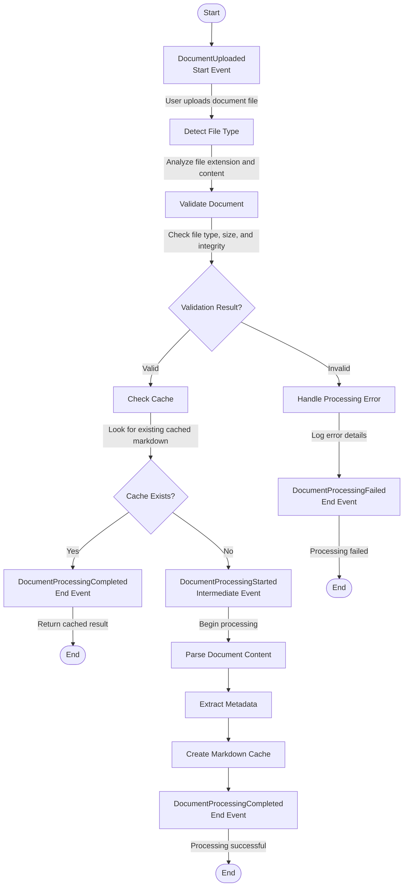

## Business Process Documentation Guidelines

This guide explains how to document business events, activity flows, and event sequences in specification documents.

## Business Events

Business events represent occurrences in the business process that trigger actions or state changes. Events are defined using event-driven architecture concepts.

### Event Structure

Each business event should include:
- **Event Name**: Unique identifier for the event
- **Event Type**: Start, Intermediate, or End event
- **Trigger**: What causes this event to occur
- **Payload**: Data associated with the event
- **Consumers**: Which processes or handlers consume this event
- **Business Context**: Business meaning and impact

### Event Types

- **Start Event**: Initiates a business process (e.g., document uploaded)
- **Intermediate Event**: Occurs during process execution (e.g., processing started, validation completed)
- **End Event**: Concludes a process or sub-process (e.g., processing completed, processing failed)

### Event Documentation Example

```markdown
- **Event: DocumentUploaded**
  - **Event Type**: Start Event
  - **Trigger**: User uploads a document file to the system
  - **Payload**: 
    - `file_path`: String - Path to uploaded document
    - `file_type`: String - Detected file type
    - `file_size`: Integer - File size in bytes
    - `upload_timestamp`: DateTime - When upload occurred
  - **Consumers**: Document validation process, file type detection handler
  - **Business Context**: Represents the initiation of document processing workflow

- **Event: DocumentValidationCompleted**
  - **Event Type**: Intermediate Event
  - **Trigger**: Document validation checks (file type, size, corruption) are completed
  - **Payload**:
    - `document_id`: String - Unique document identifier
    - `validation_result`: Enum - Valid, Invalid, Rejected
    - `validation_errors`: Array[String] - List of validation errors if invalid
    - `validated_at`: DateTime - When validation completed
  - **Consumers**: Document processing orchestrator, error handling service
  - **Business Context**: Determines whether document can proceed to processing stage
```

## Activity Flow Diagrams

Activity flow diagrams show the sequence of activities and decision points in a business process, including events that occur during the flow.

### Mermaid Activity Diagram Example



### Activity Flow Diagram Guidelines

- **Start with a start event**: Clearly mark the event that initiates the process
- **Show activities**: Document each activity/action in the process
- **Include decision points**: Use `if/then/else` to show branching logic
- **Mark events**: Clearly label Start, Intermediate, and End events
- **Add notes**: Use notes to provide context for activities and events
- **Show all paths**: Include both success and error paths
- **End clearly**: Use `stop` to mark terminal states

## Event Sequence Diagrams

Event sequence diagrams show the flow of events between different components/services in the system, illustrating how events are published and consumed.

### Mermaid Sequence Diagram Example

```mermaid
sequenceDiagram
    actor User
    participant Upload as Upload Service
    participant Events as Event Bus
    participant Validation as Validation Service
    participant Cache as Cache Service
    participant Processing as Processing Service

    User->>Upload: Upload document
    activate Upload
    Upload->>Events: **DocumentUploaded** (Start Event)
    deactivate Upload

    Events->>Validation: DocumentUploaded event
    activate Validation
    Validation->>Validation: Detect file type
    Validation->>Validation: Validate file
    Validation->>Events: **DocumentValidationCompleted** (Intermediate)
    deactivate Validation

    alt Validation Result = Valid
        Events->>Cache: DocumentValidationCompleted event
        activate Cache
        Cache->>Cache: Check for cached markdown
        
        alt Cache Exists
            Cache->>Events: **DocumentProcessingCompleted** (End Event - from cache)
            deactivate Cache
        else Cache Missing
            Cache->>Events: Cache miss
            deactivate Cache
            
            Events->>Processing: Process document
            activate Processing
            Processing->>Events: **DocumentProcessingStarted** (Intermediate)
            Processing->>Processing: Parse content
            Processing->>Processing: Extract metadata
            Processing->>Processing: Create cache
            Processing->>Events: **DocumentProcessingCompleted** (End Event)
            deactivate Processing
        end
    else Validation Result = Invalid
        Events->>Processing: DocumentValidationCompleted event (invalid)
        activate Processing
        Processing->>Events: **DocumentProcessingFailed** (End Event)
        deactivate Processing
    end
```

### Event Sequence Diagram Guidelines

- **Identify actors**: Start with external actors (User, System)
- **Show participants**: Include all services/components involved
- **Include Event Bus**: Show event bus/message broker as a participant
- **Mark events**: Use bold (**) to highlight events in the flow
- **Show activation**: Use `activate`/`deactivate` to show when components are active
- **Include alternatives**: Use `alt/else` blocks to show conditional flows
- **Label event types**: Clearly indicate (Start Event), (Intermediate), (End Event)
- **Show internal actions**: Include activities within services between events

## Documentation Checklist

Use this checklist to verify business process documentation is complete:

### Event Documentation
- [ ] All business events are documented with complete structure
- [ ] Event types (Start/Intermediate/End) are clearly identified
- [ ] Event triggers are clearly defined
- [ ] Event payloads include all necessary data fields with types
- [ ] Event consumers are identified
- [ ] Business context is explained for each event

### Activity Flow Diagrams
- [ ] Start event is clearly marked
- [ ] All activities in the process are shown
- [ ] Decision points and branching logic are included
- [ ] Both success and error paths are documented
- [ ] End events are clearly marked
- [ ] Notes provide context for activities and events
- [ ] All possible paths through the process are covered

### Event Sequence Diagrams
- [ ] All relevant actors and participants are included
- [ ] Event bus/message broker is shown
- [ ] Events are clearly marked (bold) and labeled with type
- [ ] Component activation/deactivation is shown
- [ ] Alternative flows (alt/else) are included
- [ ] Internal activities between events are documented
- [ ] Event flow from publisher to consumers is clear

### Overall Completeness
- [ ] Activity flow and sequence diagrams are consistent
- [ ] Events in diagrams match documented event definitions
- [ ] All event types are represented in the diagrams
- [ ] Error handling and exception flows are documented
- [ ] Diagrams are readable and well-organized

