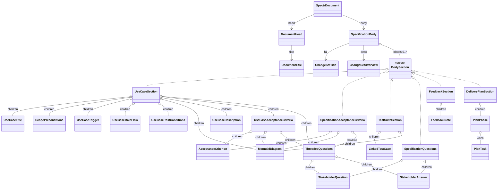
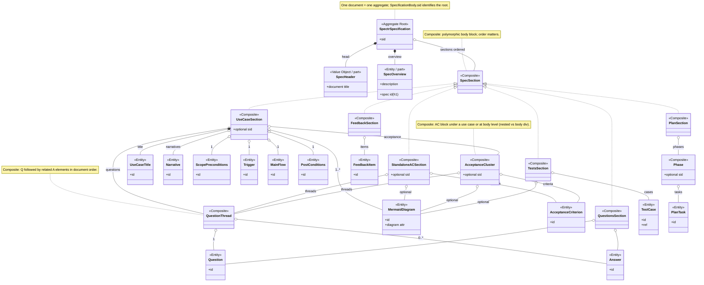

# Spectr spec XML entity model

Pydantic-XML models for a Spectr specification document (`SpectrDocument` root). Source: `spectr/src/spectr/spec_xml_model.py`.

Layout constraints (body `<div>` block order, use-case child sequence, acceptance-criteria vs questions ordering) are enforced by Pydantic **`model_validator`** hooks on `SpecificationBody`, `UseCaseSection`, `UseCaseAcceptanceCriteria`, and `SpecificationAcceptanceCriteria` during `SpectrDocument.from_xml_tree`.

`BodySection` is a type alias (union) in code, not a class; it is shown below as a logical grouping for `SpecificationBody.blocks`.



All listed element classes extend `BaseXmlModel` from pydantic-xml; attributes (`id`, `sid`, `type`, and other XML attributes) are omitted from the diagram for readability.

## Conceptual model (aggregates & composites)

This view uses domain-driven design language: **aggregate** marks a consistency boundary (typically one persisted Spectr document), **composite** marks a tree of parts that share a structural invariant, and **entity** marks something with a stable identity (`id` / `sid` in XML). It is a conceptual map to the shapes above, not a second parallel type hierarchy in code.



**How this lines up with the implementation diagram:** `SpectrDocument` / `SpecificationBody` realize **SpectrSpecification**; `DocumentHead` / `DocumentTitle` → **SpecHeader**; `ChangeSetTitle` + `ChangeSetOverview` → **SpecOverview**; each major body block model (`UseCaseSection`, `SpecificationAcceptanceCriteria`, …) → a **SpecSection** specialization; under **UseCaseSection**, `ScopePreconditions` / `UseCaseTrigger` / `UseCaseMainFlow` / `UseCasePostConditions` are mandatory `<p type="…">` in that order, followed by one or more `MermaidDiagram` (`<p type="mermaid">`) with at least one `diagram="use-case"`; `MermaidDiagram` may also appear under `UseCaseAcceptanceCriteria`, `SpecificationAcceptanceCriteria`, and `TestSuiteSection`; nested vs body-level acceptance blocks → **AcceptanceCluster** vs **StandaloneACSection**; `ThreadedQuestions` / `SpecificationQuestions` → **QuestionThread** nesting or top-level **QuestionsSection**; `PlanPhase` / `PlanTask` → **Phase** / **PlanTask**.

### Use-case structure (XML) — mandatory order

Inside `<div type="use-case">`, after `<h3>`, this order is **required** (each `<p>` needs a unique `id`):

1. `<p type="scope-preconditions">`
2. `<p type="trigger">`
3. `<p type="main-flow">`
4. `<p type="post-conditions">`
5. One or more `<p type="mermaid" diagram="…">` — **at least one** must have `diagram="use-case"` (Mermaid **use case diagram** source in the element body; e.g. `useCaseDiagram` …).
6. Optional narrative `<p id="…">` (no `type`, or a narrative-only `type` not reserved elsewhere).
7. Optional nested `<div type="acceptance-criteria">` and/or `<div type="questions">` (acceptance-criteria before questions).

Additional `<p type="mermaid">` blocks may use other `diagram` values (e.g. sequence, class) when you attach diagrams under acceptance-criteria or tests sections.

| Kind | `type` / attributes |
|------|----------------------|
| Scope & preconditions | `type="scope-preconditions"` |
| Trigger | `type="trigger"` |
| Main flow | `type="main-flow"` |
| Post conditions | `type="post-conditions"` |
| Mermaid (reusable) | `type="mermaid"`, optional `diagram="use-case"` \| … |

**CLI:** `spectr uc update --id <h3-or-uc-dom-id> --sid <uc-sid> …` accepts `--pre`, `--trigger`, `--flow`, and `--post` (HTML-capable text, same as `--desc`), plus existing `--title` / `--desc`. Example:

```bash
spectr uc update --sid uc-22222222 \
  --pre "Actor is logged in; appointment service available." \
  --trigger "User chooses Book from the home screen." \
  --flow "<ol><li>System shows slots</li><li>User confirms</li></ol>" \
  --post "Appointment row exists with status pending."
```
